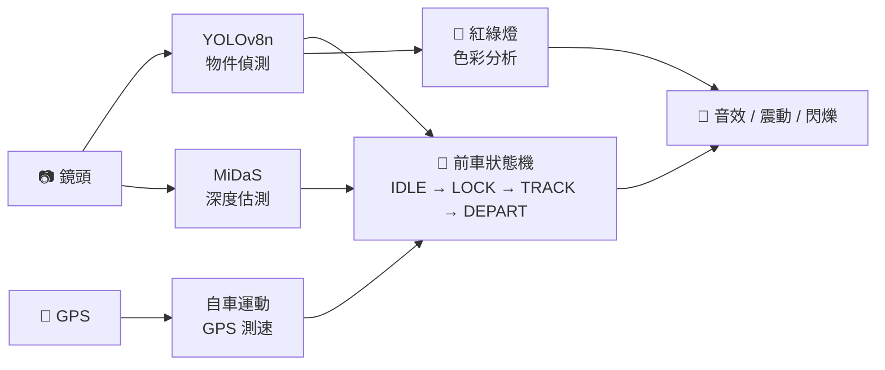

# A-Eye v6 — AI 駕駛起步警示系統

> 📱 PWA 行車輔助 App，利用 YOLOv8n 物件偵測 + MiDaS 深度估測 + GPS 測速，  
> 在等紅燈時提醒駕駛人：**前車已起步**、**綠燈亮了**。
>
> - 可於畫面上分別開關 🚗 **前車起步偵測** 與 🚦 **紅綠燈偵測**（偏好會被記住）
> - 無論紅綠燈與否：前車起步皆須通知
> - 無論有無前車：紅燈轉綠燈皆須通知
---

## ✨ 功能特色

| 功能 | 說明 |
|------|------|
| 🚗 前車起步偵測 | YOLO 鎖定 + **OpenCV.js 稀疏光流 (LK)** + 背景抖動扣除 + FOE 徑向投票，只判方向不用閾值 |
| 🟢 紅綠燈變換提醒 | 紅→綠自動提醒，含色彩分析 |
| 🚙 自車運動偵測 | GPS 測速，行駛中靜默、靜止時才發通知 |
| 📏 深度估測 | MiDaS 輔助判斷「最前方」車輛 |
| 🔔 多重提醒 | 音效 + 震動 + 螢幕閃爍 |
| 📱 PWA | 可安裝到手機桌面，支援離線使用 |
| 📡 GPS 速度顯示 | 即時顯示當前車速 (km/h) |

---

## 🏗️ 系統架構



---

## 🔄 前車追蹤狀態機

| 狀態 | 說明 | 轉換條件 |
|------|------|----------|
| **IDLE** | 無前車 | 偵測到車輛 → LOCKING |
| **LOCKING** | 候選車確認中 | 連續 3 幀 IoU 匹配 → TRACKING；失敗 → IDLE |
| **TRACKING** | 追蹤中 | 靜止時光流多數決連續 3 tick 偵測到「朝 FOE 徑向位移」→ ⚡ 前車已起步；車輛消失 → DEPARTING；行駛中 → 靜默 |
| **DEPARTING** | 確認離開中 | 車輛重現 → TRACKING；連續 5 幀消失 → ⚡ 前車已駛離 |

> 移動判定使用 **OpenCV.js 稀疏光流（Lucas-Kanade）**：bbox 內撒 Shi-Tomasi 特徵點，背景另撒一組點用中位位移扣掉手機抖動；每點再以 FOE（畫面中央偏上）為圓心取徑向投影符號，多數朝向 FOE（車變遠）即判為起步。**完全不使用像素/百分比閾值**。

### 通知邏輯

| 自車狀態 | 事件 | 會通知？ |
|----------|------|----------|
| 🚗 移動 | 任何事件 | ❌ 全部靜默 |
| 🛑 靜止 | 前車起步（光流：朝 FOE 徑向位移多數決） | ✅ 會通知 |
| 🛑 靜止 | 紅→綠 | ✅ 會通知 |
| 🛑 靜止 | 前車消失（連續 5 幀） | ✅ 會通知 |

---

## 📂 專案結構

```
A-Eye/
├── index.html          # PWA 主頁面 + UI 樣式
├── app.js              # 核心邏輯（~1200 行）
├── yolo-classes.js     # COCO 80 類別名稱
├── manifest.json       # PWA manifest
├── sw.js               # Service Worker（離線快取）
├── export_models.py    # 模型匯出/下載腳本
└── models/
    ├── yolov8n.onnx    # YOLOv8n 物件偵測（~6.2 MB）
    └── midas_small.onnx # MiDaS Small 深度估測（~17 MB）
```

---

## 🚀 快速開始

### 1. 取得模型

```bash
pip install ultralytics onnx onnxruntime
python export_models.py
```

### 2. 啟動伺服器

```bash
# 需要 HTTPS 才能使用 GPS + 相機
npx serve .
```

### 3. 手機開啟

1. 用手機瀏覽器開啟 `https://<你的IP>:3000`
2. 允許**相機**與**定位**權限
3. 點擊「開始偵測」，將手機固定在擋風玻璃前

> 💡 可點擊「加到主畫面」安裝為 PWA App

---

## ⚙️ 關鍵參數

| 參數 | 值 | 說明 |
|------|----|------|
| `DETECT_INTERVAL` | 100ms | 所有判定統一 tick（YOLO / MiDaS / UFLD / 光流） |
| `EMA_ALPHA` | 0.18 | Bbox 平滑係數（越低越穩） |
| `OF_INPUT_W × H` | 320×180 | 光流降採樣解析度 |
| `OF_MAX_FG_POINTS` | 40 | bbox 內光流特徵點上限 |
| `OF_MAX_BG_POINTS` | 40 | 背景（手機抖動基準）特徵點上限 |
| `OF_CONFIRM_TICKS` | 3 | 連續 N tick 多數決一致才觸發起步 |
| `OF_VOTE_MARGIN` | 2 | 朝 FOE 票數 − 遠離 FOE 票數 之最小差距 |
| `GPS_MOVE_SPEED` | 1.5 m/s | GPS 移動門檻 (~5.4 km/h) |

---

## 📱 技術棧

- **ONNX Runtime Web** 1.17.0 — 瀏覽器端 AI 推論（WebGL / WASM）
- **YOLOv8n** — 即時物件偵測（640×640, 80 類）
- **MiDaS Small** — 單目深度估測（256×256）
- **OpenCV.js** 4.9 — LK 稀疏光流（Shi-Tomasi + calcOpticalFlowPyrLK）
- **TensorFlow.js + COCO-SSD** — 降級備援方案
- **GPS** (`navigator.geolocation`) — 自車速度偵測
- **PWA** (Service Worker + Wake Lock + PiP)

---

## TODO
-[ ]前車起步事件能否精準判定 : 可能前車未動被判定有動、可能偵測步道前車、可能偵測到其他車道的車或機車
-[ ] 紅綠燈偵測是否精準: 可能偵測不到或者多個紅綠燈號誌偵測錯。

---

## 📄 License

MIT License — 詳見 [LICENSE](LICENSE)
