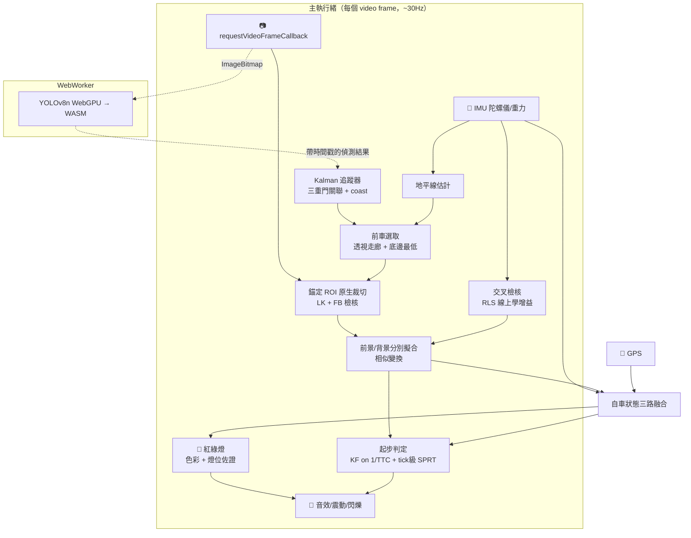

# A-Eye v7 — AI 駕駛起步警示系統

> 📱 PWA 行車輔助 App。等紅燈時提醒駕駛人：**前車已起步**、**綠燈亮了**。
>
> v7 是一次針對「誤警太多、漏報也不少」的結構性重寫。
> 判定量測從「逐點光流投票」換成**影像尺度變化率（1/TTC）**，
> 統計觀測單位從 point 改成 tick，ego-motion 補償改由 **IMU 陀螺儀**主導，
> 並新增**離線回放評測**管線，讓調參第一次有客觀依據。

---

## v6 → v7：改了什麼、為什麼

| # | v6 的問題 | 後果 | v7 的作法 |
|---|---|---|---|
| 1 | SPRT 把 bbox 內 ~40 個特徵點當成 40 筆**獨立**觀測 | 前車是剛體，點的位移高度相關，有效樣本數 n_eff ≈ 1。證據被膨脹約 30 倍，**單一幀就能觸發** | 觀測單位改成 **tick**：80 個點先擬合成「1 個尺度參數 + 標準誤」，一個 tick 一筆觀測 |
| 2 | FOE 寫死在 `(0.5W, 0.45H)`，且 LLR 只打折（0.85）不歸零 | 自車靜止時 FOE 在數學上不存在。任何持續偏壓的穩態值是 `net/(1−0.85) = net×6.7` → **放著不動也會誤報** | 完全不用 FOE。改測**尺度變化率** `V = −d·log(尺度)/dt = 1/TTC`；證據隨時間指數衰減且有物理下限 |
| 3 | 只取殘差的 `sign()`，不看量級 | 次像素雜訊區等於擲硬幣 | 用背景殘差自我校準出 σ，量測值改成標準化的 `z = −log(s_rel)/σ`，保住 SNR |
| 4 | 光流跑在**整幀降採樣到 320×180** | 10m 外前車以 1m/s 起步的邊緣位移僅 ~1.2px，和 LK 雜訊底同量級（SNR < 1） | 對 bbox 做**原生解析度裁切**（錨定 ROI，最長邊 ≤384px），同情境位移 ~5px |
| 5 | bbox 來自幾百毫秒前的幀，光流抓的是最新幀 | 前景點撒到背景上 → 假殘差 | YOLO 移進 **WebWorker**；主執行緒用 `requestVideoFrameCallback` 跑光流，ROI 用 **KF 預測到「現在」**的框 |
| 6 | 前景點沿用 `nextPts`，只檢查 LK 的 `status` | 追丟的點滑到背景仍繼續投票 | **forward-backward 一致性檢核** + 強制剔除跑出目標框的點 |
| 7 | 背景 RANSAC 假設「bbox 外都是靜止的」 | 路口旁車道車流佔多數時，RANSAC 鎖到移動車群 → **誤報起步** | IMU 陀螺儀交叉檢核：預測與觀測不符超過 4σ → 該 tick 標記不可信、不累積證據 |
| 8 | 每 tick 串行跑 YOLOv8s@640 + MiDaS@256 + UFLD@800×288 | 實際 tick 率推估僅 1~2 fps，LK 的 small-motion 假設崩潰 | 砍掉 MiDaS、暫時移除 UFLD、YOLO 降到 **yolov8n@384 + WebGPU** 並移進 Worker |
| 9 | MiDaS 取 bbox 內**所有像素平均**當深度，且輸出是逐幀變動的 relative inverse depth | 選錯前車 | 用**透視幾何**：bbox 底邊越低 = 越近。免費、跨幀穩定 |
| 10 | `EMA_ALPHA=0.18` + `IOU_LOCK_MATCH=0.15` | 起步時 bbox 縮小，滯後的平滑框 IoU 掉破門檻 → 追蹤斷 → **證據被 `ofReleaseAll()` 清空**，恰好在最該報警的那一刻 | **Kalman + 三重門關聯**（IoU / 中心距 / 尺寸比）+ 遺失時**coast 而非歸零** |
| 11 | 「中央 60%」的固定硬閘 | 不分遠近，一律用同一個畫面比例 | 走廊半寬由**地面平面幾何**推導：`半寬_px = (車道半寬/相機高度)·(y−y_horizon)`，焦距自然消掉 |
| 12 | GPS `speed` 不可用時「維持上一狀態」 | 初值 `false` → GPS 一失效就**行駛中也照報**；反之會永久靜默 | **三路融合**（GPS / IMU 加速度變異數 / 視覺背景殘差）+ 明確的 `unknown` 第三狀態 |
| 13 | `models/ufld_tusimple.onnx` **從未存在** | `useUfld` 一直是 false，車道線功能從來沒運作過 | 移除，改由 IMU 地平線 + 透視走廊取代（見 #11） |
| 14 | 1906 行單檔、~40 個模組級全域變數、判定與 DOM 交纏 | 無法單元測試、無法離線回放 → 只能盲調 | 拆成 21 個模組；`src/core/pipeline.js` **不 import 任何 DOM**，同一份 pipeline 同時驅動即時 App 與離線評測 |
| 15 | 完全沒有耗時量測，也沒有任何客觀指標 | 不知道實際 tick 率、不知道誤警率 | **除錯面板**（各階段 ms + 實際 Hz）+ **錄影/標註/回放評測**管線 |

另有死碼清除：`nextYoloTime`/`nextDepthTime`/`nextUfldTime`、`MOVE_*` 五個常數、`bboxHistory`、`moveConfirmCount`、`ofFgAliveMask` 在 v6 都是宣告後從未使用。

---

## v7 首次路測 → v7.1：四個實測才會現形的問題

第一次實車路測的症狀是「前車起步幾乎都不通知，而且畫面上有一個綠色虛線框
框住自己的引擎蓋」。這兩件事其實是同一條因果鏈。

| # | 症狀 | 根因 | 修法 |
|---|---|---|---|
| 1 | 綠框框住自己的引擎蓋 / 儀表板 | YOLO 會把引擎蓋、儀表板、玻璃反光認成 `car`。前車分數 `= proximity × 走廊權重`，而 `proximity` 直接由 bbox 底邊高度決定 → **這種假框底邊在畫面最下方，分數必定最高**。走廊在畫面下緣寬達 ±44% 畫面寬，攔不住它 | **不用硬性排除**（「底邊太低就排除」會誤殺 3m 內底邊被畫面裁掉的真前車，手機架高看不到引擎蓋時更是純傷害）。改成三項軟性加權相乘，每項都由實體尺寸推導：(a) 車尾長寬比先驗；(b) `w_px/Δy = 車寬/相機高` 的高側離群 —— 兩個距離估計相除後**焦距自己消掉**，所以這個比值對地面上的任何車輛都是常數，不在地面上的自車結構才會偏高；(c) **看得到一對對稱剎車燈**的正向**加分**（只加分不扣分 —— 扣分會造成自我毀滅的震盪，見下文根因 2）。外加**自車結構黑名單**：自車行駛中連續 2 秒「完全不動」的框只可能是自車的一部分（路邊停的車在自車前進時 bbox 會放大）→ 記下該影像區域排除。只在行駛中學習，否則紅燈停車時會把真前車列進黑名單 |
| 2 | 前車起步不通知 | 承 #1 —— 鎖定的目標是一個**永遠不動的東西**，光流量它量得再準，`V` 也永遠是 0。這是結構性漏報，不是靈敏度問題 | 同 #1 |
| 3 | 通知遲鈍 / 證據累積不起來 | 尺度是拿**相鄰兩幀**擬合的。訊號 `Δlog(尺度) ∝ dt`，而雜訊（LK 次像素誤差）**與 dt 無關** → 40ms 的基線把 SNR 壓到最低：`1/TTC = 0.1` 時兩幀之間尺度只變 0.4%。SPRT 的效應量 `μ=2` 代表單筆 `z < 1` 的觀測會讓 LLR **倒扣**，於是證據永遠到不了 `A = 9.16` | 改成**不重疊的固定基線**（`flow.baselineMs = 240`）：LK 仍每幀追點，但尺度是拿「240ms 前的位置 → 現在」擬合，擬完立刻把參考位置移到現在。SNR 提升約 6 倍，而且**因為基線不重疊，相鄰量測近似獨立**，SPRT 的累積不會重複計算同一份證據（重疊基線等於重犯 v6 把相關觀測當獨立的錯） |
| 4 | 證據卡住不動 | `coast()` 每幀都被呼叫（累積基線中、重新錨定、點數不足都算沒量測），但它用的衰減量是「距**上一筆量測**的時間」→ 同一段時間被重複扣，證據被超線性打掉。另外它每幀把 `aboveSinceTs` 歸零，`dwell` 這道閘門結構上不可能通過 | 衰減改用 `lastDecayTs` 只扣「上次衰減到現在」這一小段；`coast()` 不再清掉 dwell 計時 |

另外兩項可見度修正 —— 路測時手機上沒有 console，看不見的東西等於不存在：

* **徽章直接顯示 `departure.lastReason`**（`llr-low` / `z-low` / `no-upward` / `dwell` /
  `untrusted` / `ego-moving`…）。只給「證據 42%」無法區分「訊號不足」和「某道閘門卡住」。
* **虛線門檻改成 `1.8 × 偵測週期`**。原本寫死 60ms，而 `detectHz = 8` 本來就每 125ms
  才更新一次 → 每個框幾乎永遠是虛線，「實線=觀測到／虛線=預測的」這個語意整個失效。

還有一項是統計正確性的順帶修正：「往地平線方向移動」的佐證原本把每一筆 `dyRel` 的
**符號**都丟進投票池，但次像素雜訊的符號等於擲硬幣，比例會被鎖在 0.5 附近 ——
等於一道隨機閘門。現在只有位移量超過 `upwardMinPx` 的量測才有投票權。

---

## v7.1 第七次除錯（2026-09-11）：手持工況 —— 尺度量錯了維度

第一支**手持**（非支架）的素材。使用者回報「bbox 還是會框到自車車內」。
這一輪推翻了兩個先前的假設，並且換掉了量測用的那個維度。

### 這支影片的工況為什麼是新的

先前所有素材都是**架在擋風玻璃上的螢幕錄影，畫面裡沒有任何車內裝**。
手持之後儀表板佔了畫面下半，而且帶來一件比假框更關鍵的事：

> **前車的輪胎接地點被自車儀表板遮住了。**

實測：前車車尾可見底邊在 y≈620，儀表板上緣在 y≈624 —— 中間只剩 4px。
而整套幾何（`proximity`、`w/Δy`）全部假設「bbox 底邊 = 接地點」。

### 根因：選取與量測用的是同兩個被污染的量

| | 真前車 #3 | 儀表板假框 #4 |
|---|---|---|
| `plaus` 幾何可信度 | **0.000 ~ 1.000（亂跳）** | **1.000（每幀滿分）** |
| `w/Δy` | 1.6 ↔ 5.9 | 1.03（穩定但無意義） |
| `proximity` | 0.53 | **1.0（理論最大值）** |
| 被選中 | 幾乎沒有 | **每一個 tick** |

底邊被截斷 → Δy 偏小 → `w/Δy` 暴衝 → 真前車被高側離群檢定打成 0 分；
而儀表板的底邊就在畫面最下緣 → `proximity` 必定最大。
**兩邊的誤差方向相反，一起把排序推向錯的那一個。**

### 被實測否決的三條路（都留下來，免得再走一次）

**(a) 幾何門檻（`h/Δy ≥ 車高/相機高`）。** 分母是設定值 `cameraHeightM`，
手持高度一變判據整條平移。這和 v6「中央 60% 硬閘」是同一種錯誤換個包裝。

**(b) 視差（內裝 Z≈0.5m vs 車外 Z≈5~50m）。** 逐列光流實測：
內裝帶 **1.2~1.3 px/幀**、車外帶 **1.0~1.2 px/幀** —— 沒有數量級差。
手持晃動是**旋轉主導**的，而旋轉對所有深度產生相同位移。

**(c) 可行駛區域分割。** 跑通了 SegFormer-B0@Cityscapes，它給出兩個否定答案：

| 區域 | 分類 |
|---|---|
| 儀表板中央 / 中控螢幕 | `car` **100% / 99%** |
| 方向盤 | `car` 77~86% |

因為**語意分割必須給每個像素一個類別，沒有「以上皆非」**。Cityscapes 有
`ego vehicle` 標籤但在 19 類訓練集裡是 void，所以內裝必然被塞進最近的類別。
（DETR 能把內裝假框壓到 0%，靠的正是它有明確的「無物件」輸出。）

而且這支影片**自車道幾乎沒有可見路面**：五幀裡全幀 road 佔比 0.07%~1.0%，
其中兩幀自車道 **0%** —— 遮罩無事可做。

> 另記：TwinLiteNet 與 TwinLiteNetPlus-nano 都能匯出成極小的 ONNX
> （296KB / 307KB，且 ONNX 與 torch 輸出一致到 3.3e-05），但兩份公開權重
> 在官方前處理下（RGB、/255、640x360 / 640x384）都產不出有效遮罩 ——
> 在「架在擋風玻璃、路面為主」的夜間畫面上也一樣。改用支架時若要重評估，
> 起點是找一份能通過這個 sanity check 的權重，而不是再調前處理。

### 真正的修法：尺度量錯了維度

同一台車、同一段時間的原始偵測框（前車在 t≈2.2s 才起步）：

```
車靜止 0.2~2.0s   寬度 581 582 587 584 590 583 584 589 589    變異 0.78%
                  高度 370 378 645 624 627 631 629 638 439    變異 22.6%
起步 2.0~4.8s     寬度 574 → 217（單調）  →  V = 0.347（TTC 2.9 秒）
```

一個 600ms 窗口內的訊號約 19%，於是訊噪比：

| 量 | 訊噪比 |
|---|---|
| **寬度** | **24 : 1** |
| 高度 | **1 : 1** |
| √(w·h)（原本在用的） | 約 1.6 : 1 |

**高度完全不帶資訊**，而 √(w·h) 等於拿乾淨訊號去和純雜訊平均。
實測後果：車明明停著，√(w·h) 卻量出 V 中位 0.251、最高 0.507，
LLR 衝到 11.6（門檻 9.2）—— 這是誤報，不是靈敏度問題。

所以 `bboxScale` 的尺度改成**只用寬度**；位置佐證也從框心改成**上緣**
（框心 = y + h/2 同樣吃到被污染的高度：車靜止時框心擺盪 130px、上緣只有 11px）。
這也回到專案自己的地面真值 —— README 前面那條 LED 尾燈帶量的就是**寬度**。

### 被裁切的邊是「設限值」，不是量測

使用者的反駁很關鍵：「內裝的 bbox 有時候也會忽大忽小，這樣就算尺度變化了吧」。
確實如此 —— 實測那個內裝框量出 **V = 0.061**（`minInvTtc` 的 3 倍、TTC 16 秒），
物理上就長得像「一台正在緩慢駛離的車」。所以「內裝尺度恆定、結構上不可能觸發」
這個說法是錯的。

正確的論證不是「抖動夠小」，而是**拒絕去量一個量不到的東西**：
自車儀表板的框左右兩緣都貼著畫面邊（實測 5/5 幀），寬度被畫面卡死 ——
那不是「尺度穩定」的證據，而是這個量根本沒被量到。
於是規則是：**左右兩緣同時被畫面裁切 → 不產出量測**（`width-censored`）。

回歸測試裡的對照組確認了這個區分：框沒貼邊、高度狂抖 ±30%、寬度恆定
→ 產出 80 筆量測、**0 次誤報**。

### 架構改動：讓選錯目標不再致命

三種「辨識出內裝」的方法全被否決之後，改變的是架構而不是判據：
**起步量測同時跑在所有候選 track 上**（`pipeline.js` 的 4.5 節），
選取只決定「哪一個享有昂貴的光流路徑」。`bboxScale` 只吃框的數字、
不碰像素，每個候選各跑一份幾乎免費。

兩件必須守住的事：目標本人不在候選路徑重複計算（否則同一份物理事實
被計入兩次證據，正是 v6 SPRT 的原始錯誤）；冷卻改成管線級（否則
同一次起步會被多個候選各報一次）。

### 結果（該支手持影片，離線跑機）

| | 修正前 | 修正後 |
|---|---|---|
| 內裝框產出的量測 | V=0.061、LLR 3.3 | **0 筆**（`width-censored`） |
| 真前車靜止期的 V | 中位 0.251、最高 0.507 | 雜訊降到 0.78% |
| 事件 | **0 個** | **🚗 前車已起步 t=4.20s**（真起步 t≈2.2s） |

警示是在「選中的目標仍然是內裝框」的情況下報出來的 —— 這正是這次架構改動的目的。
延遲 2.0 秒偏慢（bbox 這條路需要三個 600ms 窗口），但這是這支影片上第一次真的報出來。

### 追記（同日稍晚）：2 秒延遲的真正來源，以及選取的修法

使用者實測回饋「2 秒延遲不能用，而且不准」。追查後發現兩件事疊在一起：

**(1) 離線跑機一直用 8Hz 偵測驗證，而手機上 DETR 實測只有 1.2Hz。**
bbox 尺度那條路要求 600ms 窗口湊滿 3 筆偵測（= 需要 5Hz），在實機速率下
根本湊不滿 —— 量測間隔被拉到 ~2.5 秒，正好掉進本頁「根因 1」算過的
SPRT 不可達區（飽和上限 6.3 < A=9.16）。**凡與量測率有關的結論，
現在必須用 `DETECT_HZ=1.2` 重跑才算數**（跑機已加上這個開關）。

**(2) 所以實機上唯一夠快的路是光流（每幀都跑、不經過偵測器），
而它被錯誤的選取浪費在內裝框上。** 修選取 = 同時修延遲與準確度：

* **可量測性硬閘**：左右兩緣同時被畫面裁掉的框不能當目標 —— 它的寬度被
  畫面卡死，結構上不可能產出起步量測，選了只會佔住光流與剎車燈這兩條
  昂貴路徑（實測內裝框 5/5 幀如此、真前車 0/21）。這是 `width-censored`
  同一條規則，也是唯一保留一票否決權的判準。
* **「最近」改用影像寬度排序**，不再用底邊高度 —— 底邊已被證明被遮擋污染
  （內裝假框拿理論最大值 1.0、真前車只有 0.53），而寬度的排序不含焦距、
  不含相機高度、左右緣不受下緣遮擋影響。
* **軟性檢定的總懲罰加下限（`vetoFloor: 0.15`）** —— 與 zClamp 同哲學：
  模型誤差不是高斯的，`w/Δy` 吃到被污染的底邊時給出 e^-26 那種「無限否決」
  把真前車打成 0 分。軟性證據可以降權，不可以有一票否決權。
* **底邊被裁的框補上 h/Δy 低側檢定**（`h_px/Δy = H_obj/h_cam`，焦距消掉）。
  對底邊被裁的框這個方向是安全的：遮擋只會把比值往上推，低側異常不可能是
  遮擋造成的。實測分布：假框 ≤ 0.93（儀表板 0.86~0.93、引擎蓋 0.69）、
  真車 ≥ 1.17（由車高下限 1.4m 推導；3m 近車實測 1.28）—— 界線放兩簇正中間。

結果（同一支手持影片）：

| | 之前 | 修選取後 @8Hz | **修選取後 @1.2Hz（實機速率）** |
|---|---|---|---|
| 目標 | 內裝框（每 tick） | 真前車，新鮮 100% | 真前車，新鮮 85% |
| 光流量測 | 錨在不動的內裝上 | ok 12 筆 | ok 11 筆 |
| 起步警示 | 4.20s（延遲 2.0s） | **2.90s** | **2.80s（延遲 0.6s）** |
| 剎車燈 | 讀的是內裝 | 踩下 0.8s、鬆開 2.0s | 鬆開 2.0s |

支架素材（乾淨.mp4 44~62s）回歸：🟢 綠燈 47.40s 不變、誤報 0，
且 🟠 鬆開剎車（57.20s）**回來了** —— 這個事件在改動前的 HEAD 上已經消失
（README 上一輪記錄的是 57.8s），寬度排序選到的目標更穩（證據清空 9 → 4 次），
剎車燈分析才又看得到真的燈。

### 仍然未解

* 走廊與剩餘的幾何檢定仍建立在 `cameraHeightM` / `horizonFallback` 上，
  手持工況下這兩個值只是猜測 —— 現在它們只做軟性降權，但仍是雜訊來源。
* 剎車燈判讀在手持晃動下的可靠度未驗證（取樣區是 bbox 的固定比例）。
* 仍然沒有標註語料庫 —— 每一輪還是在對最後一支影片驗證。

## v7.1 第六次除錯（2026-09-10）：偵測器換成 DETR，以及四個「同一個病灶的不同化身」

這一輪從「前車起步完全沒判斷出來」開始，最後換掉了偵測器。中間找到的東西
全部不是門檻問題 —— 而是把某個量當成另一個量在用。

### 先確立地面真值

量錄影裡那條全寬 LED 尾燈帶的**寬度**（與程式無關）：

```
t=50.0 ~ 56.0   267~301 px   ← 六秒鐘紋風不動
t=56.4  249     t=57.4  225
t=56.8  217     t=58.0  175
```

車在 **t≈56.2** 才起步，`V = −d·log(w)/dt = 0.22`（TTC 4.6 秒）。
前面 56 秒的 `below-min-ttc` 全部是**正確**行為。而使用者在 t=58.0 切走 App
—— 真正的窗口只有 **1.8 秒**。

### 根因 1：SPRT 在低量測率下**結構上不可能觸發**

四個參數之間有一條沒人檢查過的可達性條件：

```
單筆量測能貢獻的 LLR 上限   perMeas = zClamp·μ − μ²/2 = 3·2 − 2 = 4
量測間隔 Δt 下的飽和上限     ceil = perMeas / (1 − e^(−Δt/τ))

τ=1.2s → Δt > 689ms（< 1.45Hz）時 ceil < A = 9.16
```

**無論前車跑多快，量測慢於 1.45Hz 就永遠到不了門檻。** 而實測光流就是這種
速率（18 秒內 135 個 tick 只有 36 筆量測，而且叢發）。跑機印出來的
`LLR=7.4/9.2` 不是巧合，那**就是飽和上限**。

修法是反推而不是調參：由「保證的最低量測率」+ 2 倍餘裕 → `τ ≥ 2.44s`，取 2.5。
誤警測試全部仍是 0 次/小時，高取樣率下的延遲數字與先前記錄的**逐字相同**
（5m 450ms、10m 550ms、20m 950ms）—— 取樣充足時毫無影響，只解開了稀疏時的死結。
這個條件現在寫成 `bboxscale.test.mjs` 裡的不變量。

### 根因 2：只有一條量測路徑，可用率 27%

光流（= 文獻上的 optical expansion，Yang & Ramanan CVPR'20）比較準，但
`accumulating` / `reanchor` 讓它只有 27% 的 tick 產出量測。1.8 秒的窗口跑不完。

加上**第二條路：bbox 尺度變化率**（`src/motion/bboxScale.js`）。這是量產
camera-only FCW 的基礎作法（Mobileye 2004），而 `KalmanBox.logScaleRate`
其實一直在算，只是從沒餵給起步判定。三個必須守住的紀律寫在檔頭：
不吃 KF 濾波後狀態（相關）、不重疊的固定基線、σ 由殘差自己估。

### 根因 3：「統計顯著」被當成「物理上夠大」

`bgExpZ = log(s_bg)/(σ_s/s)` 是背景尺度變化的**顯著性**，而 σ_s 是近百個
背景點的標準誤（~3e-4）。實測面板 `bgExpZ=8.0` 換算回物理量是背景 TTC ≈ 100 秒
—— 站著不動。但它是 8σ，於是 `ego=moving` → `canAlert=false` →
`departure.update()` 每個 tick 走 `reset()`，**整個起步判定無聲關閉**。

而且錯誤有反向誘因：**光流做得越準 → σ 越小 → 越容易被誤判成行駛中。**

修法：顯著性與物理量分開，兩個都成立才算在動（`visualStaticInvTtc: 0.05`）。

### 根因 4：狀態會抖，而抖一下就清空證據

ego 逐 tick 判定，18 秒內 still/moving 來回 17 次，每次都歸零：
`t=48s n=7 LLR=6.2 → t=49s n=0`。兩處修正，都與既有作法同源：

* 視覺路徑加 dwell（`visualMoveDwellMs: 500`），與 GPS 的 `gpsMoveDwellMs` 同源；
  退出 MOVING 不設 dwell（不對稱是刻意的）
* `ego-moving` 從 `reset()` 改成 `coast()` —— 這是這個檔案裡最後一處硬歸零。
  安全性靠的是 `canAlert` 擋觸發，不是清空證據；持續行駛時收不到量測，
  `coast()` 會在 `coastMs` 之後自己歸零

### 偵測那一半：三個實測

**(a) letterbox 填成黑色是 bug。** Ultralytics 訓練與推論用的都是灰
`(114,114,114)`，而 worker 填的是 `#000`。直式 720×1280 塞進 640×640 時
**黑邊佔輸入面積 44%** —— 等於每幀塞一大塊訓練時沒見過的東西。
改一個常數（與長寬比、橫直方向無關），能進追蹤的幀 19% → 36%。

**(b) 猜錯的那個：解析度不是瓶頸。** 原本以為「直式塞進正方形，前車只剩 140px」。
實測裁一塊正方形（黑邊 0%、前車像素大 1.7 倍）：找到率 69% → 71%，**沒有用**。

**(c) 真正的答案是換模型。** 同一批畫格、門檻 0.50：

| | 抓到真前車 | 信心中位 | **內裝假框出現的幀** |
|---|---|---|---|
| yolov8n@640 | — | 0.20 | — |
| yolov8s@640 | 42% | 0.62 | **11%**（門檻 0.30 時 25%） |
| **DETR@480** | 50% | **0.91** | **0%** |
| DETR@320 | 58% | 0.93 | 3% |

方向盤/儀表板被認成 `car` 是 YOLO 這條路的**結構性**問題：COCO 沒有
「車內裝」這一類，YOLO 的每個 anchor 只能在既有類別裡挑最像的
（夜間儀表板 = 深色圓弧 + 水平發光帶 = 特徵空間裡的夜間車尾）。
實測內裝假框最高信心 **0.73**，比一半以上的真車還高 ——
**任何信心門檻都分不開**。DETR 有明確的「無物件」類別可以輸出，
這才是假框歸零的機制；集合預測不需要 NMS，也就不會把前車和旁車併成一個大框。

代價是速度：手機 WebGPU 實測 480px `infer 527ms → det 1.2Hz`。
換 fp16 權重（輸入輸出仍是 float32，純檔案替換）：

```
門檻 0.30/0.50/0.70/0.90 → 抓到真前車 64%/58%/53%/42%   fp32 與 fp16 完全相同
                          內裝假框    11%/3%/3%/0%      完全相同
前車信心中位 fp32 0.914 vs fp16 0.916；同幀信心差平均 0.0017
```

準確度零代價、檔案 166.8 → 83.8MB。而且這是**必要**的：GitHub 單檔上限
100MB，fp32 那份根本推不上去。

### BYTE 兩段式關聯

實測那台前車的偵測信心**中位數只有 0.19**，而門檻是 0.30 —— 同一批畫格只改門檻：
`conf ≥ 0.30 → 22%`、`conf ≥ 0.05 → 69%`。整條管線 78% 的時間看不到前車。

照 ByteTrack（ECCV 2022）的作法：低分框（≥ `confLow`）只跟**既有 track** 配、
只用 IoU、門檻更緊、不建立新 track、不累積 `confirmHits`。
用「有沒有對應的既有軌跡」當先驗來分辨真物體與背景，不必降低整體門檻。

> 接 DETR 時這一段一度失效（`decodeDetr` 在 `confThreshold` 就丟框，
> 面板顯示 `低分框 0 → 救回 0`）—— 由實機面板抓到並修正。

### 方向盤：底邊被裁掉的框改查「低側」

`egoRegions=0` —— 自車結構黑名單只在**自車行駛中**學習，停等紅燈時結構上
學不到，而那正是引擎蓋/方向盤擋視野的時候。幾何加權又只查高側離群，
方向盤在直式畫面裡 Δy 大、比值反而偏低，一分都沒扣。

新增的論證只對**底邊被畫面裁掉**的框生效：接地點在畫面外 → 至少那麼近 →
寬度有下限 `w_min = (W_car/h_cam)·(vh − y_horizon)`（焦距一樣消掉）。
588×980、地平線 0.45 → 汽車 809px、機車 359px，**都比畫面 588 還寬**。
所以貼著下緣卻只有兩三百 px 寬的框，幾何上不可能站在地面上。
一般情況不查低側是為了不誤殺機車，而「底邊被裁掉」是完全不同的狀況。

### 前後對比（乾淨影片 44~62s，離線跑機）

| | 修正前 | 修正後 |
|---|---|---|
| 目標新鮮 | 50% | **93%** |
| ego 抖動時的證據 | `n=7 → n=0` | **`n=7 → n=9`** |
| 事件 | 0 個 | 2 個（🟢 綠燈 47.4s、🟠 鬆開剎車 57.8s） |

### 仍然未解

「🚗 前車已起步」還是沒觸發。目前卡在**目標選取的穩定性**：起步窗口內
目標在 #22 → #25 → #26 之間跳，框寬 293 → 132 → 230，於是量出
**V=0.660（TTC 1.5 秒）** 的假訊號。這已經不只是漏報風險，是**誤報**風險。

而真正能終結「每一輪都對最後一支影片過擬合」的，還是那個一直沒做的東西：
用 `replay.html` 建立標註語料庫，讓每次改動都用誤警/小時與 recall 把關。

---

## v7.1 第五次除錯（2026-09-10 夜間錄影）：剎車燈亂跳、框幾乎全是虛線

使用者回報兩件事：「車燈判別不準、車框也幾乎都是綠色虛線」。
這兩件事是同一條因果鏈的兩端。

### 先確立「燈到底有沒有熄」——直接量錄影的像素，不看 app 說什麼

前四次除錯有一次栽在「用錄影的像素去反推程式的內部狀態」（數綠色像素段），
所以這次反過來用：**量的是物理訊號本身，與 app 的判定完全無關**。
在那台廂型車的第三剎車燈與左右尾燈位置各開一個固定視窗，逐幀取紅度最大值：

```
t=0.0 ~ 10.0s   第三燈 158~183    左尾燈 121~162   右尾燈 170~189
```

**燈一次都沒有熄過。** 而同一段時間畫面上的 toast 反覆跳
「🟠 前車鬆開剎車」→「⏸ 前車踩下剎車」。所以這不是靈敏度問題，是誤判。

### 根因 1：第三剎車燈就長在 bbox 上緣那條線上，餘裕是零

放大同一支影片的兩個時刻（框的線型就是新鮮度指示）：

| | 框 | 燈在 bbox 內的 y |
|---|---|---|
| t=5s | 實線（剛偵測） | **0.036** —— 貼著上緣 |
| t=23s | 虛線（KF 外推） | **−0.16** —— 在框**上方 27px**，整個掉出去 |

第三剎車燈依法裝在車後中線、高於煞車燈，實務上就在車頂線上；
而 YOLO 的車輛框上緣**就是**車頂線 —— 兩者重疊在同一條線上。
搜尋範圍只取「bbox 上緣 40%」，往上一點餘裕都沒有，
所以框只要往下漂一點點，網格就讀到純車身 → 判成熄滅 → 誤報「鬆開剎車」。

修法是裁切時往 bbox 上緣**之外**多留 `topMarginFrac = 0.25` 個框高
（實測最壞偏移 0.16，取 1.5 倍餘裕）。往上延伸不會把別的紅光吃進來：
x 只有 ±13%、而且還要通過 `litVsGrid` / `litMin` 與位置追蹤。

### 根因 2：位置追蹤存的是 bbox 比例 —— 等於把框的誤差直接加到燈上

`opticalFlow` 那一輪的教訓寫在 README 裡：
**「任何以 bbox 固定比例當基準的空間參考都會被框的抖動害死」**。
但第三剎車燈的位置追蹤本身還是存成 bbox 正規化座標，等於沒躲掉同一個坑
（這是同一個坑的第三次）。

一格只有 bbox 寬的 2.2%（實測約 5px），框抖一下就整個讀空。修法兩項：

* 追蹤位置改存**影像座標**，每個 tick 由它與當前裁切矩形重新換算成格子索引
  → 框怎麼漂，取樣點都還在同一顆燈上
* 讀值取 **±1 格鄰域的最大值**，吸收次格級的捨入誤差

### 根因 3：框不新鮮時照樣分析剎車燈

左右燈區與車身參考區都是「bbox 的固定比例」，而 KF 外推的框會漂。
漂掉的框讓取樣區落在車身甚至框外，於是峰值/谷值被汙染。
改成**框不新鮮就跳過**：狀態本來就有黏性，少一筆量測遠好過一筆錯的量測。

### 根因 4：虛線門檻用的是設定值，不是實際偵測速度

`coasting` 的門檻寫的是 `1.8 × (1000 / detectHz)` = 225ms。
但 `detectHz` 只是**提交上限**，真正的節拍由推論速度決定 ——
而 **`models/yolov8n_384.onnx` 從來沒有被產生過**（`models/` 裡只有
640 的 `yolov8n.onnx` 與 `yolov8s.onnx`，實測 onnx 的輸入是靜態
`[1,3,640,640]`），所以線上跑的一直是 640px。
推論一慢，每個框就永遠是虛線 —— 這個指示燈等於壞掉，
而它是使用者**唯一看得到**的偵測健康度指標。

改成用 `onDetections()` 量到的實際間隔（EMA），設定值只當下限。
同一段影片上 `目標新鮮` 從 65% 變成 74% —— 框沒有變好，是**尺規本來是錯的**。

> 真正要讓框變新鮮，還是得跑 `python export_models.py` 產生 384 版模型。
> 那不是程式改得掉的事。

### 前後對比（同一支 27 秒錄影、同一份 pipeline、離線跑機）

| | 修正前 | 修正後 |
|---|---|---|
| 事件總數 | **8**（4 次假「鬆開」+ 3 次假「踩下」） | **2** |
| 剎車燈狀態 | 11~13s 誤判 `off`，之後 on/lit/off 反覆跳 | **全程 lit/on，沒有一次誤判 off** |
| 目標新鮮 | 65%（尺規是錯的） | 74%（量到的） |

修正後剩下的兩個事件是合理的，而且順序對：

```
   19.40s  🟠 前車鬆開剎車，準備起步
   21.30s  🚗 前車已起步！
```

（19.0s 三個燈區的紅度確實同時掉了一次 —— 那是真實的訊號，不是誤讀。）

回歸測試 `brakelight.test.mjs` 新增「框漂移 0.16 個框高 + 逐幀抖動 ±8px 時
不得誤報鬆開」。把 `topMarginFrac` 改回 0 會有 4 項掛掉
（讀到的值從 170 掉到 20），所以它有牙齒。

> **輸入的誠實說明**：這次的離線跑機吃的是「app 執行畫面的螢幕錄影」裁切後的結果，
> 多經過一次 H.264 壓縮、而且畫面上有 overlay。所以絕對偵測率是「不高於」實際值的
> 估計；但前後兩次跑的是同一份輸入，剎車燈的前後對比不受影響。

---

## v7.1 路測（2026-09-08 夜間）：兩個用實測資料才抓到的根因

第一次真正拿著除錯面板上路，面板直接把答案印出來了：

```
V=0.000±100.000 z=0.00/3.72 LLR=0.00/9.16 TTC=-- n=0 idle
brake lvl=0.73/0.70 peak=1.06/0.93 c=3.80 sym=0.04 on
flow FAIL: accumulating
flow ok 0/225 | accumulating:165 fg-fit-fail:41
```

### 根因 1：`cv.estimateAffinePartial2D` 在官方 opencv.js 裡不存在

`flow ok 0/225`、`fg-fit-fail:41` —— 41 次完成基線的量測**全部**在前景相似變換擬合
那一步失敗，所以 `departure` 一筆量測都沒收到（`n=0 idle`、`V=0.000±100.000`
就是 reset 後的初值）。

原因是 [opencv/opencv#20538](https://github.com/opencv/opencv/issues/20538)：
**官方 opencv.js 沒有把 `estimateAffinePartial2D` 編進去**（只有 6 自由度的
`estimateAffine2D`）。它是 `undefined`，呼叫就丟例外，被 `try/catch` 吃掉後回傳 `null`。

也就是說**尺度變化率這條路從 v7 寫出來的那天起就沒有運作過一次** ——
「誤警太多、漏報也不少」的漏報那一半，根因就是這個。

修法不是換一個 API，而是把估計自己寫出來（`fitSimilarity()`，純 JS）：

| | 委託給 OpenCV | 自己算閉式解 |
|---|---|---|
| 自由度 | 4（但函式不存在）／6（改用 affine2D 則多兩個自由度的雜訊） | **4，正好是 σ_s 傳播公式假設的估計量** |
| 求解 | RANSAC 隨機取樣 | **Procrustes 閉式解**，不需迭代 |
| 可重現性 | 隨機 → 離線回放結果會抖 | **決定性** → replay 可重現 |
| 可測試性 | 需要瀏覽器 | **純 JS → node 可單元測試** |

推導在 `opticalFlow.js` 的註解裡：令 `q = M·p + t`、`M = [[a,b],[−b,a]]`，
對中心化座標最小化 `Σ|q − M·p|²`，兩個正規方程直接給出
`a = Σ(dp·dq)/Σ|dp|²`、`b = −Σ(dp×dq)/Σ|dp|²`。

### 順帶抓到的：σ_s 一直低報約 2.4 倍

寫單元測試驗證「回報的 σ_s 與實際散布是否一致」時發現：殘差**大小**是 Rayleigh
分布而不是零均值常態，對大小取 MAD 會低估每軸 σ 約 2.4 倍。後果有兩個：

1. 離群點剔除門檻過嚴 → 好點被大量丟掉
2. **σ_s 低報 → SPRT 過度自信 → 實際誤警率遠高於設定的 α**

改成由 Rayleigh 中位數關係反推（`median/1.1774`）並加上自由度校正 `√(n/(n−4))`
之後，`similarity.test.mjs` 量到的「回報 σ_s / 實際散布」是 **0.93~0.99**（原本 ~0.4）。

### 根因 3：GPS 的靜止漂移會讓整個紅燈靜默

實測停在路口不動時，`coords.speed` 會跳到 **2~5 km/h**。而原本的遲滯有一個
致命的不對稱：

```
進入 MOVING：速度 > 1.5 m/s（5.4 km/h）—— 一個尖峰就夠
退出 MOVING：速度 < 0.5 m/s（1.8 km/h）—— 漂移永遠達不到
```

漂移只要出現一次尖峰就把狀態鎖進 MOVING，然後在 2~5 km/h 之間徘徊、
永遠回不到 STILL → **整個紅燈都靜默**。而且這是**無聲的失效**：
畫面上只顯示「🚙 行駛中 — 靜默中」，使用者不會知道自己其實已經停下來了。

三道修正：

| 修正 | 作法 |
|---|---|
| 尖峰不算行駛 | 進入 MOVING 需要速度**持續**超過上緣 `gpsMoveDwellMs`（1.2s） |
| 定位品質太差就不用 GPS | `accuracy > 40m` → 速度視為不可用（速度是位置差分來的，位置抖幾十公尺就會憑空生出幾 km/h） |
| **視覺否決** | 速度低於 `gpsCreepCeiling`（10 km/h）且**背景尺度完全沒變** → 相信視覺，判為靜止 |

第三項是新增的第四路訊號，而且它的物理性質特別乾淨：自車前進 → 背景（路面、
建物、旁車）逼近 → 背景尺度 > 1。**旋轉不改變尺度**，所以這一路對手機晃動
天然免疫（位移殘差那一路不是）。而且 `bgFit` 本來就算好了，成本是零。

刻意只在低速時允許否決：真實高速行駛時若視覺證據失效（背景太遠、夜間無紋理），
否決會變成「行駛中照報警」——那是比漏報更危險的失效方向。

`ego.test.mjs` 把實測的漂移樣態直接編碼成測試，並附上舊行為的對照組。

### 根因 5：外側尾燈本來就是個很差的訊號源 —— 該看的是第三剎車燈

一路以來所有的機制（峰值/谷值、面積×亮度、動態範圍解析、`lit` vs `on`）
都是為了對抗**同一件事**：外側那兩顆燈兼作尾燈，平常就亮著，踩剎車只是「變更亮」。
實測落差只有 **1.5 倍**（122 → 65）。

而**車頂中央那顆第三剎車燈不接尾燈電路**，只在踩剎車時亮。
同一段影片實測落差 **70 倍**（145 → 0）。

而且它的位置與行為是**法規訂死的**，不是猜的
（[車輛安全檢測基準 附件三十八](https://www.rootlaw.com.tw/Attach/L-Doc/A040110050009300-1140120-14000-067.pdf)；
1995-07-01 起新領照小客車強制）：

> 「應裝置於車後中線且其基準中心應高於煞車燈基準中心」
> 「踩下煞車踏板時，應為續亮，不得閃爍」

| 法規要求 | 對演算法的意義 |
|---|---|
| 車後**中線** | 搜尋範圍由幾何決定，不必猜 |
| 基準中心**高於**煞車燈 | 在 bbox 上部，與尾燈幾何分離 |
| **續亮不得閃爍** | 這條路徑不需要閃爍抑制 |
| 只在踩下煞車踏板時亮 | **尾燈/剎車燈的歧義從根本消失** |

實車驗證（同一段夜間影片）：

```
38.3s  偵測到「踩下」（人工判讀 38.1s，差 200ms = confirmMs）  val 142  peak 142
46.5s  偵測到「鬆開」（人工判讀 46.3s）                        val   0  peak 142
踩下 → 鬆開 = 8.2s，鬆開 → 車實際移動 ≈ 0.9s
```

#### 我在這裡連續踩了兩個坑，都是同一個教訓

**坑一：以為可以用「空間對比」做無狀態判定。** 想法是「中央格比左右鄰居紅很多
就是踩著剎車」，不需要記憶。用 2 幀驗證覺得漂亮，用 84 幀驗證就**直接重疊**：

```
38.1s  燈 142，鄰居  74 → 比值 1.9  判「踩著」✓
38.2s  燈 143，鄰居 178 → 比值 0.8  判「沒踩」✗
```

燈本身沒變（142→143），是**鄰居**跳掉了 —— 因為 YOLO 的框每幀都在抖
（266×262 → 283×267），「bbox 上緣 12.5%」這條帶會蓋到車身的不同位置。
**任何以 bbox 固定比例當基準的空間參考都會被框的抖動害死。**

**坑二：搜尋範圍設太寬。** 原本設 x 中線 ±22%、y 上半部 55%，結果右邊界碰到
**右尾燈**（值 68），在第三燈還沒亮時就把追蹤位置鎖在那裡，之後真正的燈亮起
（142）也讀不到。收窄到 ±13% / 上緣 40% 之後兩者才幾何上分開 ——
而這個「窄」本來就寫在法規裡（車後中線、高於煞車燈），是我沒照著做。

正確的做法：**不跟空間鄰居比，跟這顆燈自己的過去比**（既有的峰值/谷值機制），
再加上**位置追蹤**（燈在車上不動，位置的穩定性本身就是一道驗證）與
「出現更強候選就重新鎖定」的恢復路徑。

#### 額外收穫：「踩下」是更早的前兆

自排車從 P/N 打入 D **必須踩剎車**。實測那位駕駛整個停等（38 秒）都沒踩剎車，
直到 38.3s 才踩下 —— 也就是說「暗了很久之後亮起」領先車輛實際移動約 **9 秒**，
比「鬆開」的 0.9 秒早得多。

而這個「暗 → 亮」的轉換**只有第三剎車燈看得到**：外側燈全程亮著（尾燈），
根本不存在這個邊緣。

9 秒太早，出聲會變成干擾，所以它是**無聲事件** —— 徽章與分析時間軸看得到，
不發出聲音與震動（`chmsl.alertOnPress` 可開）。

#### 什麼時候會退回外側燈判定

機車（沒有第三剎車燈）、被頭枕或載貨遮住、1995 年前的老車、車太遠
（框寬 < 150px，實測 84 幀裡唯一判錯的就是車駛遠之後那一幀）、
以及**鎖定時燈就已經亮著**（峰值 = 谷值、還沒看過落差 → 誠實回報不可用；
但燈一熄範圍就在同一畫格解析，「鬆開」照樣抓得到）。

### 根因 4：「剎車燈亮」是一個沒有證據的預設

面板顯示 `燈位準 9 / 峰值 9 = 1.00` → 判「亮」。但這個推論不成立：
**只看過一個位準時，無法知道那是尾燈還是剎車燈**。實車量測同一台車的
剎車/尾燈位準差 **5.9 倍**（59 vs 10），所以如果一開始只看到尾燈，
它就會變成峰值，然後被判成「亮」。

兩個方向的證據強度根本不對等：

| 判定 | 證據 |
|---|---|
| 「熄」 | 位準掉到峰值的 0.45 以下 —— **那個落差本身就是證據** |
| 「亮」 | 原本只是「位準等於自己的峰值」—— 這在第一次觀察時恆真，等於沒有證據 |

所以狀態改成四種，並且只在**動態範圍已解析**（`峰值/谷值 ≥ 1.8`）時才敢說「踩著」：

| 狀態 | 意義 |
|---|---|
| `lit` | 有一對紅燈亮著，但分不出尾燈/剎車（尚未看過落差） |
| `on` | 剎車踩著（範圍已解析） |
| `off` | 已鬆開（位準明顯低於峰值） |
| `unknown` | 過曝，或看不到一對紅燈 |

確認過一次熄滅就代表範圍 ≥ `1/offRatio = 2.2`，所以第一次「鬆剎車」照樣會觸發
（落差是自我驗證的），之後才會出現 `on`。實車影片重跑驗證：仍在 46.6s 觸發、
提前 800ms，而剎車期間誠實顯示 `lit`。

順帶修掉兩個藏在裡面的細節：谷值的初值必須是 `Infinity` 而不是 0
（完全熄滅時位準就是 0，用 0 當哨兵會讓最乾淨的落差被當成「還沒觀察到」），
而且谷值**不能**只在 `present` 為真時更新 —— 燈全暗時 `present` 會正確地變成
false，若把谷值鎖在裡面，最低點永遠記錄不到。

### 根因 2：剎車燈的 ROI 取錯位置，而且夜間不能用亮度判斷

面板顯示 `brake ... c=3.80 ... on` —— 剎車燈**亮**的判定是對的，但**熄滅**永遠判不出來。
把影片畫格丟進 `lampStats()` 逐格量測後看到兩件事：

**(a) ROI 帶取錯**：原本設 `yTop=0.38`，但實測 SUV 的尾燈在 bbox 高度的
**0.28~0.38** —— ROI 剛好從燈的下緣才開始，量到的其實是保險桿上的**反光片**，
而反光片反射的是自車大燈，剎車燈熄了它照樣紅。改成 0.15~0.85 同時涵蓋
SUV 與房車（房車尾燈約在 0.45~0.60）。

**(b) 夜間亮度分不開，只有面積分得開**（前車剎車燈亮→熄，熄/亮的比值）：

| 統計量 | 左燈 | 右燈 | 對 `offRatio=0.45` |
|---|---|---|---|
| topK(12%) 平均紅度（原本用這個） | 0.64 | 0.76 | ❌ 永遠達不到 |
| 全區平均紅度 | 0.31 | 0.45 | ⚠ 右燈剛好卡在門檻 |
| 紅度超過 θ 的**面積**比 | 0.22 | 0.30 | ✅ |
| **面積 × 燈芯亮度**（採用） | 0.17 | 0.24 | ✅ 餘裕最大 |

原因是剎車燈與尾燈共用同一燈室，**夜間相機的紅通道兩者都飽和（貼到 255）**，
峰值亮度在數學上被裁掉了；真正變的是光暈與被照亮燈殼的面積。
取「面積 × 亮度」= 對紅光通量積分，飽和不會把積分裁掉，而且對「剎車燈是獨立
燈泡、亮度變而面積不變」的車款也成立。

修好之後在同一段影片上重跑：**t=46.6s 判定熄滅，車實際開始移動（bbox 開始縮小）
是 t=47.4s → 提前 800ms**。這些數字寫成了 `brakelight.test.mjs` 的回歸測試
（用量到的統計量直接組直方圖，不需要把影片放進 repo）。

### 還有一個差點漏掉的邊界

亮燈時 `contrast = 1.80~1.94`，而 `minContrast` 原本設 **1.8** —— 剛好卡在門檻上，
有些 tick 直接掉到門檻下。而且對比在**熄燈時反而更高**（3.0~6.9），因為亮燈時
光暈把中央參考區的車牌與尾門也照紅了。所以 `contrast` 只能用來判斷
「有一對紅燈」，不能用來判斷「剎車燈亮」；門檻改成 1.35（要排除的全紅車身是 0.96）。

---

## v7.1 第四次除錯：把 pipeline 搬到 node，一次找出三個真根因

### 先撤回上一節的結論

上一節寫「問題不在判定，在偵測 —— 目標 79% 的時間是舊的」。**那個量測是錯的。**
我數的是錄影裡「綠色像素的連續段」，而夜景本身就有大量零散的綠色像素
（綠燈、招牌、偏綠的車燈），我量到的是那些，不是 overlay 的框。

改用 `models/yolov8n.onnx` 直接在那 45 秒的畫格上跑（同一份 letterbox / 解碼 / NMS）：

| 信心門檻 | 有任何車框 | 有「前車」框 | 前車信心 中位/最小 |
|---|---|---|---|
| 0.30（現行） | 96% | **95%** | 0.54 / 0.34 |
| 0.15 | 100% | 100% | 0.54 / 0.17 |

**偵測沒有問題。** 產生 384px 模型或降低信心門檻都不會解決那次漏報。

### 於是把整條 pipeline 搬到 node

`onnxruntime-node` 能跑那個 onnx、`opencv.js` 能在 node 載入
（順帶獨立驗證了 `estimateAffinePartial2D` 真的 undefined），
所以整條 pipeline 可以離線重現 —— 見 [`tools/offline/`](tools/offline/)。

這是這次能查到根因的原因。在瀏覽器裡只看得到「證據 0%」；
離線跑機印出的是「光流 ok 21，失敗：reanchor:64 fg-too-few:15 bg-too-few:9」。

### 根因 1：夜間的車尾沒有紋理，光流連點都撒不出來

實測那台近距離白車：**目標框內 81% 的像素落在最暗的 32 階**。
`goodFeaturesToTrack` 在原始灰階上：

| qualityLevel | 前景點 | 通過 FB |
|---|---|---|
| 0.01（現行） | **1** | 0 |
| 0.001 | 10 | 9 |
| 0.01 + **CLAHE** | **50** | **50** |

而 `minFgPoints = 12`，所以每一 tick 都 `fg-too-few`。更糟的是
`needAnchor` 的條件包含「前景點不足」→ **每個 tick 都重新錨定**
（180 幀裡 reanchor 64 次）→ 240ms 基線永遠完成不了 → 起步判定永遠收不到量測。

修法是在 `_captureGray` 加上 CLAHE（對比度受限的自適應直方圖等化）。
「受限」這一項是必要的：它避免把暗區雜訊也放大成假角點。

### 根因 2：我加的「缺燈懲罰」是一個自我毀滅的迴路

離線跑機把候選分數拆開之後看得很清楚（t=154）：

```
#9 329x242 prox=0.84 cw=1.00 plaus=1.00 lamp=0.35 新鮮=1.00 → 0.293   ← 真前車
#12 78x46  prox=0.57 cw=1.00 plaus=1.00 lamp=1.00 新鮮=1.00 → 0.566   ← 遠處小車
```

真前車拿到 `lamp=0.35`（「看很久卻沒看到剎車燈」的懲罰），遠處小車拿 1.00。
原因是**只有被選中的目標才會被分析** —— 所以被選中的那個永遠是唯一會被扣分的。
扣分一生效它就輸給任何還沒被分析過的競爭者 → 換手 → 新目標開始被扣分 → 震盪。
實測 8 秒內換手 9 次，每次都清空證據。

改成**只加分不扣分**（`lampBonus 1.5`）。同樣的不對稱從「震盪」變成「穩定性」：
已確認有尾燈的目標更難被搶走。而引擎蓋假框本來就靠幾何就贏不了
（實測 0.348 vs 0.420，還沒用到燈的證據）。

### 根因 3：中央參考區被第三剎車燈自己汙染

剎車燈的「有一對紅燈」判定用「燈區紅度 / 中央車身紅度」當對比，
而**法規規定第三剎車燈就裝在車後中線**。實測那台車：

```
左燈 52　右燈 56　中央車身 67  → 對比 0.72 < 門檻 1.35 → 判成「沒有一對紅燈」
第三剎車燈網格最大 193（中位數 62）  ← 燈明明就在那裡
```

第三剎車燈依法在煞車燈**之上**，所以參考區改取「燈帶以下」（`bodyYTop 0.55`）
就能避開。同一幀：中央車身 67 → **5**、對比 0.72 → **4.67** → `present=true`。

另外也讓「第三剎車燈被找到」本身就算作正向證據 —— 它比左右燈區的對比檢定可靠。

### 根因 4：過期的大框贏過新鮮的小框

前車駛遠後，一個已經過期但 KF 外推出來仍然很大的框（328x204）與真實的新框
（92x48）同時存在，而 `proximity` 只看底邊高度 → 過期的大框贏。
加上新鮮度加權（半衰期 400ms）：**coasting 的框是預測，不是量測；
兩者同時存在時量測該贏。**

### 結果：那次漏掉的起步，現在抓到了

離線跑機在同一支影片、涵蓋真正起步時刻的區間（**t≈166.5s**，
不是我一開始說的 157s —— 見下方「第五個坑」）：

```
t=165.0s  target=#5 335x242  z=0.09/3.72   V=0.000  n=8   剎車燈=lit
t=166.0s  target=#5 329x233  z=3.69/3.72   V=0.012  n=11  剎車燈=on(第三燈on)
t=167.0s  target=#9 304x216  z=88.79       V=0.131        剎車燈=off(第三燈off)
t=168.0s  target=#9 246x187  z=82.39       V=0.224  cooldown
t=169.0s  target=#9 193x165  z=158.55      V=0.297  cooldown

事件 2 個：
   166.10s  🟠 前車鬆開剎車，準備起步
   166.50s  🚗 前車已起步！
```

框從 335×242 縮到 193×165，`V` 升到 0.297（TTC 3.4 秒）—— 車確實在遠離，
而修正前的同一段是 **0 個事件**。

兩件事值得注意：

1. **兩個事件的順序與間隔是對的**：第三剎車燈先熄（166.10s），
   起步判定再確認（166.50s）。
2. **先驗確實讓警示更快**：只有起步判定時是 166.80s，加上「鬆開剎車」的
   先驗（SPRT `+ln(0.9/0.02)=3.81`、`minTicks` 4→2、`dwell` 260→120ms）之後
   變成 166.50s。整條「快路徑當先驗」的設計在真實影片上串起來了。

### 第五個坑：`ffmpeg -ss` 的位置

我一開始說「起步在 157 秒」是錯的，**真正的時刻是 163~166 秒**。
`-ss` 放在 `-i` **前面**是快速搜尋、會吸附到最近的關鍵幀，實測偏移 5~6 秒。
我被它騙了三次（包括讓一次跑機分析了完全錯誤的時段而毫無察覺）。
分析特定時段時 `-ss` 一律放在 `-i` 後面。

### 同一段影片（148~156s）的前後對比

| | 修正前 | 修正後 |
|---|---|---|
| 目標換手 | 9 次（清空證據 8 次） | **1 次（清空證據 0 次）** |
| 目標 | 在 330×240 與小框之間跳 | **全程鎖定同一台** |
| 光流 ok | 9 | **15** |
| `fg-too-few` | 5 | **0** |
| 起步證據累積 | n = 0~3 | **n = 14** |
| 剎車燈狀態 | unknown | **lit** |

---

## v7.1 第三次路測（189 秒行駛影片）：問題不在判定，在偵測

> ⚠️ **這一節的結論已被上一節推翻** —— 「目標 79% 的時間是舊的」是量測錯誤造成的。
> 保留這一節是因為它記錄了一個真實的教訓：**用錄影的像素去反推程式的內部狀態，
> 比直接把程式跑起來更容易出錯**。


使用者回報「130 秒之後有一段很明顯的前車起步完全沒被判斷出來」。
起步實際發生在 **t≈157s**。當下畫面上的徽章是：

```
🚗 追蹤前車 #201｜證據 0%｜idle｜剎車燈 亮
```

`idle` 是 `reset()` 之後的初值、`證據 0%` 代表**起步判定從來沒收到過任何量測**。
而且沒有出現「行駛中 — 靜默中」，所以自車閘門是通的 —— 問題不在那裡。

### 量化：目標有 79% 的時間是「舊的」

overlay 在「沒有新偵測」時把目標框畫成虛線。所以直接數錄影裡框邊的綠色連續段
（實線 = 一長段、虛線 = 很多短段），130~158 秒、5fps 共 140 幀：

| | 幀數 | 比例 |
|---|---|---|
| 實線（有新偵測） | 29 | **21%** |
| 虛線（coasting） | 106 | 76% |
| 沒有框 | 5 | 4% |

而且 152 秒之後到起步前，**連續約 5 秒完全沒有新偵測**。

框的尺寸很穩定（相鄰畫格面積比最大 1.19×，`scaleGate` 一次都沒觸發），
過曝比例只有 1~12% —— 所以不是關聯失敗，是**偵測本身抓不到這台夜間近距離的白車**。

### 寫測試時發現我對自己的程式理解錯了

我原本的因果鏈是「偵測間歇 → track 被淘汰 → 新 id → `targetChanged` → 清空證據」。
寫測試驗證時發現**淘汰發生在關聯之後**：只要偵測最終回來且配對成功，
track 就不會因為空白而死掉（2000ms 空白也還是同一個 track）。

真正的機制是 `confirmedOf(classIds, now, maxCoastMs)` 這道**新鮮度過濾** ——
超過 `maxCoastMs` 沒有新偵測的 track 不會被交給前車選取，於是 pipeline 走進
「沒有目標」的分支，而那裡**每個 tick 都呼叫 `flow.reset()`**，
把光流的特徵點與錨定 ROI 立刻銷毀。目標一回來就得從零重新錨定、
重新累積 240ms 基線 —— 在 79% 的 tick 都不新鮮的情況下，證據永遠累積不起來。

（順帶更正另一個我講太快的推論：我曾用「54s 時 target #173、158s 時 #201」
推論 track 反覆重建。但 id 是全域遞增的，高速路上 104 秒出現 28 台新車完全正常，
這個數字證明不了任何事。）

### 四個修正

| 修正 | 內容 |
|---|---|
| 保留錨定 | 目標短暫消失時不再立刻 `flow.reset()`，只有超過 `maxCoastMs` 才真的放棄 |
| `maxCoastMs` 700 → 1500 | 對靜止或慢速目標，KF 外推 1.5 秒仍然安全 |
| 換 id 不等於換車 | 真的換了 track id 時，用**新舊目標框的 IoU** 判斷是不是同一台車（≥ 0.5 就保留證據）。「id 變了」是實作細節，「幾何上是同一個物體」才是該用的判準 |
| 加上儀器 | 面板新增「目標新鮮 N%、換手 M 次、偵測框 X→配對 Y 新建 Z」—— 沒有這三個數字，只看得到「證據 0%」而不知道要修判定還是修偵測 |

### 但根本問題還在偵測，而我沒辦法在這裡驗證

上面四項讓「證據被反覆清空」不再發生，但**偵測只有 21% 命中**這件事沒有解決。
可能的方向（按成本排序）：

1. **產生 384px 模型**（`python export_models.py`）—— 推論從 50ms 降到約 20ms，
   偵測率翻倍，間隔從 147ms 縮到 ~70ms
2. **降低 `confThreshold`**（0.30 → 0.2x）—— 近距離、被畫面裁切、又過曝的白車
   信心分數可能就在門檻附近。但這會同時提高誤偵測，需要用 `analyze.html` 量過再決定
3. **換成 in-domain 模型**（BDD100K 訓練的 YOLOP 等）—— COCO 預訓練的 yolov8n
   從來沒見過「夜間、被自車大燈打亮到過曝的近距離車尾」

新的儀器會直接告訴我們是 1 還是 2：若 `偵測框 X` 的數字很低 → 偵測器沒輸出，
走 1/3；若 X 高但 `配對 Y` 低 → 關聯門檻的問題。

---

## 快路徑：剎車燈熄滅

前面所有的量測（尺度變化率、光流、深度）都有一個共同的天花板：**必須等車真的動了才有訊號**。
但駕駛鬆開剎車踏板到車輛實際移動之間有 0.3~1 秒，而剎車燈在鬆踏板那一瞬間就熄了。
這是唯一能讓警示「本質上變快」而不是「量得更準」的訊號源。

訊噪比也完全不同量級：5~10m 的剎車燈在影像上是數十像素的飽和紅光，
而同一情境下 240ms 基線的尺度變化只有 2.4%（要靠 80 個點做最小平方擬合才勉強看見）。

### 判定量全部是比值，沒有絕對色彩門檻

紅綠燈那條路（`trafficLight.js`）用的是絕對門檻（`r > 150 && r > g*1.45`），因為它是
**絕對分類**問題（這團紅色是紅燈？落日？紅色招牌？）。剎車燈不是分類問題，
而是**同一台被追蹤車輛、幾秒內的相對變化**，所以：

| 量 | 定義 | 它免疫了什麼 |
|---|---|---|
| 對比 | 燈區紅度 / 車身紅度 | **紅色車身**的漆面紅度被除掉 |
| 對稱性 | \|ln(左/右)\| | **方向燈**是單側 → 直接否決 |
| 位準 | 燈區紅度 / 整體亮度 | **自動曝光/增益**改變時這個值不動 |
| ON/OFF | 位準 / 自己的歷史峰值 | **夜間**尾燈長亮、剎車燈是同一燈室變更亮 —— 絕對亮度分不開，相對自身峰值才分得開 |

另外兩道防線：**雙閃**在 1.5Hz 下熄滅相只有 ~330ms，短於 `offConfirmMs = 350ms`
就已經攔掉，慢速閃爍則由週期性檢查抑制；**逆光過曝**（RGB 全部貼頂、紅度假性歸零）
一律回報 `unknown` 而**不是** `off` —— 失效模式必須是「不知道」，否則夕陽直射會誤報。

### 它不單獨觸發正式警示，而是當 SPRT 的先驗

「剎車燈熄了」語意上是**駕駛鬆了剎車**，不等於車在動（打 P/N、腳移開都會熄）。
所以它以貝氏方式進入既有的判定 —— SPRT 累積的就是對數勝算比，先驗機率的改變
剛好是「加一個常數」：

```
llr += ln( P(熄燈│即將起步) / P(熄燈│不起步) ) = ln(0.90 / 0.02) = 3.81
```

而 SPRT 上門檻是 `A = 9.16`，所以**結構上不可能靠鬆剎車就報**：
鬆了剎車但車不動 → 運動證據永遠不來 → LLR 停在先驗那一格然後被時間衰減掉。
車一動 → 只需要很少的運動證據就跨過門檻（`minTicks` 4→2、`dwell` 260→120ms）。

這兩個機率是**可以從錄影估計出來的量**，不是拍腦袋的分數 —— 這也是它們寫成
兩個機率而不是一個「先驗分數」的原因。

### 已知的覆蓋缺口（刻意保留運動判定當保險）

| 情境 | 剎車燈路徑 |
|---|---|
| 塞車**踩著剎車蠕行** | ❌ 車在動、燈全程亮著 → 沉默。這是最大的洞，也正好在核心使用場景裡 |
| 前車是**機車** | ❌ 單顆燈 → 對稱性檢查失效（而且 `vehicleClasses` 目前不含 motorcycle） |
| 前車一開始就沒亮燈（P/N/手煞車） | ❌ 沒有 ON 可觀察 → 談不上「熄」 |
| 前車嚴重偏斜、只看到車尾一角 | ❌ 回報 `unknown` |
| 距離 > 20~25m | ❌ 燈只有幾像素。但塞車/紅燈是 3~10m，正好是最佳區間 |

所以兩條路徑是 **OR** 而不是 AND：剎車燈負責快，尺度變化率負責覆蓋。

---

## 核心原理：為什麼改測「尺度變化率」

車輛沿光軸遠離時，影像等比例縮小。對影像寬 `w ∝ 1/Z` 取對數微分：

```
d/dt log(w) = −(1/Z)·dZ/dt = −V_rel/Z = −1/TTC
```

所以定義 **`V ≡ −d·log(尺度)/dt`**，單位 1/秒，物理意義就是 **1/TTC**。`V > 0` ⇔ 正在遠離。

這比逐點徑向投票好在三點：

1. **天然免疫手機抖動** — 抖動主要產生平移與旋轉，幾乎不改變尺度
2. **統計上正確** — 80 個高度相關的點濃縮成 1 個參數 + 明確的標準誤，SPRT 的獨立性假設才成立
3. **不需要 FOE，也不需要深度模型**

實作上對前景點與背景點**分別**擬合相似變換（平移+旋轉+尺度），取相對尺度 `s_rel = s_fg / s_bg` — 這還順便消掉了全域縮放（對焦呼吸、自車輕微前進）。

尺度的標準誤由最小平方傳播得到，不是憑感覺的門檻：

```
σ_s ≈ σ_residual / (r_rms · √n)
```

### 觸發需要同時滿足

| 條件 | 說明 |
|---|---|
| `z_kf = V/σ_V ≥ z_fire` | Kalman 濾波後的 V 顯著大於 0。`z_fire` 由 `α` 反推（α=1e-4 → 3.72σ） |
| `LLR ≥ A` | tick 級 SPRT 累積（高斯 LLR `μz − μ²/2`），`A = ln((1−β)/α)` |
| `V ≥ minInvTtc` | 物理下限，濾掉「統計上顯著但物理上等於沒動」 |
| dwell ≥ 260ms 且 ≥ 4 ticks | 防模型誤差造成的瞬時尖峰 |
| 影像往地平線方向移動 | 幾何佐證 |
| 自車靜止 + 背景可信 | 前置條件 |

**單 tick 的 z 被夾在 ±3**，所以單 tick 最多貢獻 LLR 4.0，而 `A = 9.16` — **結構上不可能單幀觸發**。

---

## 系統架構


```mermaid
graph TB
    subgraph MT["主執行緒（每個 video frame，~30Hz）"]
        CAM[📷 requestVideoFrameCallback] --> FLOW[錨定 ROI 原生裁切<br/>LK + FB 檢核]
        FLOW --> FIT[前景/背景分別擬合<br/>相似變換]
        FIT --> DEP[起步判定<br/>KF on 1/TTC + tick級 SPRT]
        TRK[Kalman 追蹤器<br/>三重門關聯 + coast] --> SEL[前車選取<br/>透視走廊 + 底邊最低]
        SEL --> FLOW
        IMU[📐 IMU 陀螺儀/重力] --> XCHK[交叉檢核<br/>RLS 線上學增益]
        XCHK --> FIT
        IMU --> HOR[地平線估計] --> SEL
        LIGHT[🚦 紅綠燈<br/>色彩 + 燈位佐證] --> ALERT
        DEP --> ALERT[🔔 音效/震動/閃爍]
    end
    subgraph WK["WebWorker"]
        YOLO[YOLOv8n WebGPU → WASM]
    end
    CAM -.ImageBitmap.-> YOLO
    YOLO -.帶時間戳的偵測結果.-> TRK
    GPS[📡 GPS] --> EGO[自車狀態三路融合]
    IMU --> EGO
    FIT --> EGO
    EGO --> DEP
    EGO --> LIGHT
```

**關鍵設計：偵測與追蹤解耦。** YOLO 結果帶著自己的影像時間戳回來（延遲可能 200~400ms），由 Kalman 用該時間戳更新；需要「現在」的框時再 `boxAt(now)` 外推。於是推論慢不再拖垮光流的節拍。

---

## 專案結構

```
A-Eye/
├── index.html                  # 主畫面
├── replay.html                 # ★ 離線回放評測頁
├── sw.js  manifest.json
├── src/
│   ├── main.js                 # 協調層（唯一碰 DOM 的地方 + ui/）
│   ├── config.js               # ★ 全部參數集中於此
│   ├── core/pipeline.js        # ★ 判定管線（不 import 任何 DOM）
│   ├── util/math.js            # KF / RLS / 穩健統計 / normInv
│   ├── sensors/                # gps.js  imu.js
│   ├── perception/             # detector.js  detector.worker.js
│   ├── tracking/               # kalmanBox.js  tracker.js
│   ├── motion/                 # opticalFlow.js  departure.js  egoMotion.js
│   ├── logic/                  # frontCar.js  trafficLight.js
│   ├── ui/                     # overlay.js  alerts.js  hud.js
│   ├── capture/                # frameSource.js  recorder.js
│   └── tools/replay.js         # 回放評測核心
├── tools/selftest/             # ★ 離線自我測試（node，無需瀏覽器）
├── tools/make_icons.py         # 品牌記號的唯一幾何來源 → icon.svg + 兩個 PNG
├── docs/ui-states.md           # ★ 畫面狀態全集（16 種情境與設計意圖）
├── legacy/                     # v6 原始碼（app.v6.js / index.v6.html）
└── models/yolov8n_384.onnx     # 執行 export_models.py 產生
```

`config.js` 只允許兩種數字：**物理量**（公尺、秒、m/s、弧度）與**機率**（α、β）。像素、百分比、「連續幾幀」這類拍腦袋的數字一律避免；需要尺度時用資料自己估出的 σ 做正規化。

---

## 快速開始

```bash
# 1) 取得模型（產生 models/yolov8n_384.onnx）
pip install ultralytics onnx onnxsim
python export_models.py

# 2) 啟動（GPS + 相機 + IMU 都需要 HTTPS 或 localhost）
npx serve .

# 3) 離線自我測試（不需要瀏覽器）
node tools/selftest/all.mjs
```

手機開啟 `https://<你的IP>:3000`，允許**相機**、**定位**、**動作感測器**權限。

### 用影片檔取代相機（📁 按鈕）

實車路測一趟只能驗一次，而同一段影片可以在每次改動後重跑 ——
這是把「盲調」變成「可重現」的關鍵。按控制列的 **📁** 選一個影片檔即可，
overlay、徽章、音效、除錯面板全部照常運作，影片會循環播放。

影片檔沒有 GPS / IMU，但**影片自己就能判斷自車動不動**：判定會降級到
「背景尺度變化率」那一路（自車前進 → 背景逼近 → 尺度 > 1），面板會顯示
`行駛中（visual-scale z=18.3）`。

> **第一版做錯了**：原本影片模式直接強制假設自車靜止。丟一支 189 秒的行駛
> 影片進去，行駛中前車自然一直在遠離 → 40 秒內報了 5 次「前車已起步」。
> 那不是判定失準，是用假設取代了量測。現在只有勾選「🛑 強制假設自車靜止」
> 才會回到那個行為（適合光流還沒運作、或整段都沒有前車目標的片段）。

影片模式會多出一個**分析面板**（右上角）：影片時間、前車、剎車燈狀態、
燈位準/峰值/門檻、起步證據條、未觸發原因、`flow ok` 比例，以及最重要的
**事件時間軸**（`46.60s 🟠 前車鬆開剎車…`）—— 分析影片時真正要回答的問題是
「有沒有在正確的時間點觸發」，一閃即逝的徽章答不了這個問題。

同時底部徽章在影片模式只留「事件」與「模式」兩條，避免與面板重疊。

> 桌機上看手機直式影片：影片模式用 `object-fit: contain`（相機模式是 `cover`），
> 否則 `cover` 的縮放倍率是 `max(寬比, 高比)`，會把畫面放大到只剩中間一條。

### 四條離線分析路徑的分工

| | 📁 影片模式（index.html） | `analyze.html` | `replay.html` | [`tools/offline/`](tools/offline/) |
|---|---|---|---|---|
| 環境 | 瀏覽器 | 瀏覽器 | 瀏覽器 | **node，不需要瀏覽器** |
| 問題 | 判定對不對 | 事件在第幾秒 | 誤警/漏報/延遲 | **內部狀態為什麼是這樣** |
| 輸出 | overlay + 面板 | 文字報告 | 指標 | 每一 tick 的完整內部狀態 |

前三條是給使用者用的；第四條是給除錯用的 —— 它印得出
「光流失敗了幾次、各是什麼原因、前景撒出幾個點」這種在瀏覽器裡看不到的東西。

| | 📁 影片模式（index.html） | `analyze.html` | `replay.html` |
|---|---|---|---|
| 問題 | 判定**對不對** | 事件發生在**第幾秒** | 誤警率、漏報率、延遲 |
| 驅動 | 播放 + rVFC，即時路徑 | 播放 + rVFC，可調倍速 | 逐格 seek，每格都跑偵測 |
| 時鐘 | 影片時間 | 影片時間 | 影片時間 |
| 需要 ground truth | 否 | 否 | 是（錄影時按 🚩 標註） |
| 決定性 | 否 | 否 | 是 |
| 輸出 | overlay + 分析面板 | 一份可複製的文字報告 | FP/小時、recall、延遲中位數 |

### `analyze.html`：上傳影片 → 直接列出第幾秒偵測到什麼

```
分析區間 0.0s ~ 189.1s（189.1s）
耗時 96s，處理 1420 幀（每影片秒 7.5 幀、偵測 4.0 次）
模型 yolov8n.onnx @webgpu 640px

偵測到 3 個事件：
  46.62s   🟠 前車鬆開剎車，準備起步
  53.75s   🚗 前車已起步！
  ...

── 診斷 ──
光流 ok 147/157 次完成基線的量測（94%）
偵測推論 381 次
```

三個設定值得說明：

- **播放倍速**：每一幀的處理成本（光流 + 推論）是固定的，所以倍速**只影響
  「每影片秒取樣到幾幀」，不影響判定門檻** —— 因為時鐘用的是影片時間，
  dwell / 基線 / 冷卻全部落在影片時間軸上。報告會印出實際取樣率，讓這個代價可見。
- **分析區間**：只想看 45~50 秒發生什麼，就不必跑完整支。
- **自車狀態**：預設由影片自己判斷（背景尺度變化率）；勾「強制假設靜止」
  只在光流沒運作或整段沒有前車目標時才需要。

> 為什麼不沿用 `replay.html` 的逐格 seek：seek 的延遲（每次數十毫秒）會主導總時間。
> 那條路的目的是**決定性**（同一支影片跑兩次結果完全相同），代價是慢；
> 這條路的目的是快速得到答案。

- `?debug=1` — 開啟除錯面板（各階段耗時、實際 Hz、證據累積、光流失敗原因分佈）+ Eruda console
- `?reset=1` — 清除所有快取與 Service Worker

### 建議加上 COOP/COEP 標頭

ONNX Runtime 的多執行緒 WASM 需要 cross-origin isolation。加上這兩個標頭可以讓 WASM 後端快 2~3 倍（WebGPU 可用時影響較小）：

```
Cross-Origin-Opener-Policy: same-origin
Cross-Origin-Embedder-Policy: require-corp
```

---

## 除錯面板讀法

```
frame 29.8Hz | tick 29.1Hz | flow 24.6Hz | det 7.4Hz     ← 實際節拍（v6 推估只有 1~2Hz）
tick 8.2ms (flow 6.1 draw 1.4)
yolo pre 3.1 infer 41.2 dec 1.8 → 延遲 58ms              ← 偵測延遲，KF 會補償掉
model yolov8n_384.onnx @webgpu 384px
──────────────────────────────────
ego=still(gps) 0.0km/h visσ=0.31
horizon=0.47 laneCx=0.502
V=0.118±0.013 z=9.08/3.72 LLR=11.4/9.16 TTC=8.5s n=12 FIRE
flow fg=54/71 bg=63/78(81%) sRel=0.99412±1.2e-3 dy=-2.31
imu cal=Y q=0.83 disagree=1.2σ trusted=Y
light=red(state=red) b=142 r=61@0.21 g=3@0.70 y=2
```

畫面上還會直接畫出兩條證據進度條（`z` 與 `LLR`）、走廊、地平線、ROI 範圍 — 在手機上實測時看得見證據怎麼累積，才有可能除錯。

兩條進度條分別代表什麼、為什麼要兩條（而非一條），以及其餘 15 種畫面情境的完整對照，見 **[docs/ui-states.md](docs/ui-states.md)**。

---

## 離線回放評測（強烈建議先做這件事）

沒有客觀指標的話，任何調參都只能憑「今天路上感覺比較少誤報」判斷，不可能收斂。

1. 主畫面按 **⏺** 開始錄影
2. 前車一起步就按 **🚩**（這就是 ground truth 時間點）
3. 停止後會下載三個檔案：`.webm` / `.sensors.jsonl` / `.meta.json`
4. 開 `replay.html`，把三個檔案丟進去 → 輸出

| 指標 | 意義 |
|---|---|
| **誤警 / 小時** | 最重要的指標。目標 < 1 |
| **命中率 (recall)** | 標註點在 −0.5s ~ +3s 內有警示才算命中 |
| **延遲中位數 / P90** | 從 ground truth 到警示的時間 |
| 光流失敗原因分佈 | `bg-inconsistent` 多 → 路口車流干擾；`fg-too-few` 多 → 目標紋理不足 |

回放使用**完全同一份 pipeline**，所以量到的就是真機行為。建議也錄一段「前車全程不動」的**靜止對照組**（不打任何標註），那段的所有警示都是誤警。

---

## 離線自我測試結果

`node tools/selftest/all.mjs`（不需瀏覽器，用合成訊號驗證判定器的統計行為）：

```
=== 誤警（前車完全靜止，σ_log(s)=7.1e-4、20Hz）===
  系統性偏壓 0.00σ/tick → 0 次誤警 / 小時
  系統性偏壓 0.50σ/tick → 0 次誤警 / 小時
  系統性偏壓 1.00σ/tick → 0 次誤警 / 小時

=== 真實起步（等加速度 2 m/s²）===
  5m 前方  → 450 ms（此時車速 0.90 m/s）
  10m 前方 → 550 ms（此時車速 1.10 m/s）
  20m 前方 → 950 ms（此時車速 1.90 m/s）

=== 反向情境（應永不觸發）===
  前車正在靠近 / 影像往下移 / 自車行駛中 → 全部 0 次

=== 模型誤差突波 ===
  1 個 100σ 的離群 tick → 0 次誤警（z 夾限發揮作用）
  10 個連續 5σ 的一致離群 tick → 1 次誤警

=== 追蹤中斷的韌性（v6 在此漏報）===
  V=0.20/s 且中途斷追 400ms → 950 ms 仍能報出
```

> 最後一項的誠實說明：**連續 500ms 的一致 5σ 尺度縮小，在物理上就等於真的在遠離**（V ≈ 0.07/s）。任何演算法都無法區分。這就是為什麼「背景不一致偵測」與「IMU 交叉檢核」很重要 — 它們負責在源頭攔掉這種相關誤差。

---

## 通知邏輯

| 自車狀態 | 事件 | 會通知？ |
|---|---|---|
| 🚗 移動 | 任何事件 | ❌ 全部靜默 |
| 🛑 靜止 | **前車鬆開剎車**（剎車燈熄滅持續 350ms） | ✅ 輕提示（單音 + 單次震動） |
| 🛑 靜止 | 前車起步（尺度變化率判定） | ✅ 正式警示（三連音 + 震動節奏 + 閃爍） |
| 🛑 靜止 | 紅→綠（需持續 400ms） | ✅ |
| ❓ 未知 | 任何事件 | ❌（可用 `config.ego.unknownIsStill` 改變） |
| 📁 影片模式 | 前車事件 | ✅（明確假設靜止，徽章會標示） |

「鬆剎車」與「已起步」刻意做成兩個不同強度的提示 —— 前者是預告（可能打 P/N 而不走），
後者是已確認的事實。若兩者一樣響，駕駛會分不出「該動了」和「快要該動了」。
可用 `config.brakeLight.alertOnRelease = false` 只保留正式警示。

這些事件在畫面上長什麼樣（含音效、震動節奏、閃爍顏色與徽章樣式），見 [docs/ui-states.md § 警示](docs/ui-states.md#四警示3-種)。

---

## 已知限制與下一步

- **「前車已駛離」通知已移除。** v6 用「連續 5 幀消失」判定，在低幀率下等同 2~5 秒，遮擋或漏檢就誤報。v7 的 KF coast 讓「消失」變得罕見，若要重新加入應改用「track 確實被淘汰 + 該位置無任何車輛」的雙條件。
- **車道線偵測暫時移除。** 模型檔從未存在，且 TuSimple 的訓練視角與手機安裝角度差異大。目前由 IMU 地平線 + 透視走廊取代。若日後要加回，`FrontCarSelector.select()` 已預留 `laneWeightFn` 參數（軟性加權，不做硬閘）。
- **`frontCar.cameraHeightM` 需依實際安裝高度調整**（預設 1.2m）。這個值直接決定走廊寬度，是目前最值得手動校準的參數。
- **IMU 交叉檢核需要暖機。** 陀螺儀增益用 RLS 線上學習，約需 60 個有效樣本（幾秒的正常晃動）才開始生效；在那之前退回純視覺補償。

---

## 授權

MIT — 見 [LICENSE](LICENSE)
