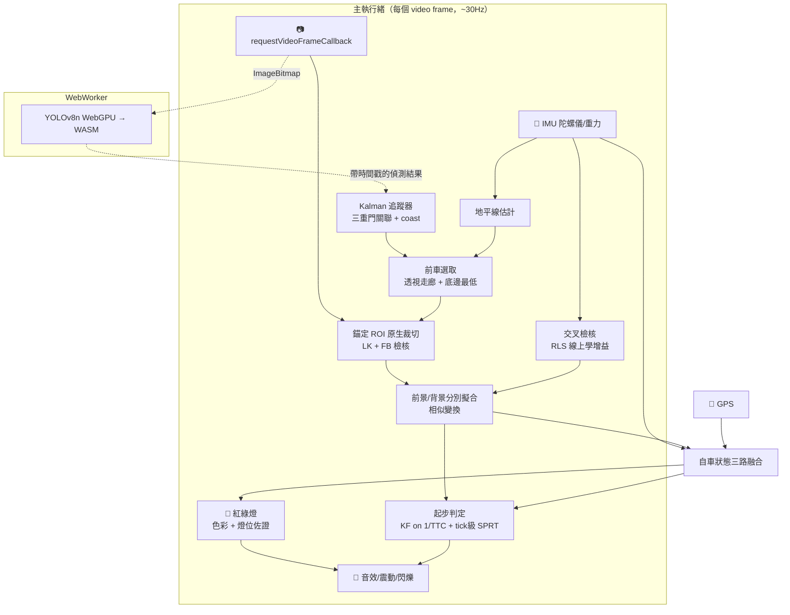

# A-Eye v7 — AI 駕駛起步警示系統

> 📱 PWA 行車輔助 App。等紅燈時提醒駕駛人：**前車已起步**、**綠燈亮了**。
>
> v7 是一次針對「誤警太多、漏報也不少」的結構性重寫。
> 判定量測從「逐點光流投票」換成**影像尺度變化率（1/TTC）**，
> 統計觀測單位從 point 改成 tick，ego-motion 補償改由 **IMU 陀螺儀**主導，
> 並新增**離線回放評測**管線，讓調參第一次有客觀依據。

---

## v6 → v7：改了什麼、為什麼

| # | v6 的問題 | 後果 | v7 的作法 |
|---|---|---|---|
| 1 | SPRT 把 bbox 內 ~40 個特徵點當成 40 筆**獨立**觀測 | 前車是剛體，點的位移高度相關，有效樣本數 n_eff ≈ 1。證據被膨脹約 30 倍，**單一幀就能觸發** | 觀測單位改成 **tick**：80 個點先擬合成「1 個尺度參數 + 標準誤」，一個 tick 一筆觀測 |
| 2 | FOE 寫死在 `(0.5W, 0.45H)`，且 LLR 只打折（0.85）不歸零 | 自車靜止時 FOE 在數學上不存在。任何持續偏壓的穩態值是 `net/(1−0.85) = net×6.7` → **放著不動也會誤報** | 完全不用 FOE。改測**尺度變化率** `V = −d·log(尺度)/dt = 1/TTC`；證據隨時間指數衰減且有物理下限 |
| 3 | 只取殘差的 `sign()`，不看量級 | 次像素雜訊區等於擲硬幣 | 用背景殘差自我校準出 σ，量測值改成標準化的 `z = −log(s_rel)/σ`，保住 SNR |
| 4 | 光流跑在**整幀降採樣到 320×180** | 10m 外前車以 1m/s 起步的邊緣位移僅 ~1.2px，和 LK 雜訊底同量級（SNR < 1） | 對 bbox 做**原生解析度裁切**（錨定 ROI，最長邊 ≤384px），同情境位移 ~5px |
| 5 | bbox 來自幾百毫秒前的幀，光流抓的是最新幀 | 前景點撒到背景上 → 假殘差 | YOLO 移進 **WebWorker**；主執行緒用 `requestVideoFrameCallback` 跑光流，ROI 用 **KF 預測到「現在」**的框 |
| 6 | 前景點沿用 `nextPts`，只檢查 LK 的 `status` | 追丟的點滑到背景仍繼續投票 | **forward-backward 一致性檢核** + 強制剔除跑出目標框的點 |
| 7 | 背景 RANSAC 假設「bbox 外都是靜止的」 | 路口旁車道車流佔多數時，RANSAC 鎖到移動車群 → **誤報起步** | IMU 陀螺儀交叉檢核：預測與觀測不符超過 4σ → 該 tick 標記不可信、不累積證據 |
| 8 | 每 tick 串行跑 YOLOv8s@640 + MiDaS@256 + UFLD@800×288 | 實際 tick 率推估僅 1~2 fps，LK 的 small-motion 假設崩潰 | 砍掉 MiDaS、暫時移除 UFLD、YOLO 降到 **yolov8n@384 + WebGPU** 並移進 Worker |
| 9 | MiDaS 取 bbox 內**所有像素平均**當深度，且輸出是逐幀變動的 relative inverse depth | 選錯前車 | 用**透視幾何**：bbox 底邊越低 = 越近。免費、跨幀穩定 |
| 10 | `EMA_ALPHA=0.18` + `IOU_LOCK_MATCH=0.15` | 起步時 bbox 縮小，滯後的平滑框 IoU 掉破門檻 → 追蹤斷 → **證據被 `ofReleaseAll()` 清空**，恰好在最該報警的那一刻 | **Kalman + 三重門關聯**（IoU / 中心距 / 尺寸比）+ 遺失時**coast 而非歸零** |
| 11 | 「中央 60%」的固定硬閘 | 不分遠近，一律用同一個畫面比例 | 走廊半寬由**地面平面幾何**推導：`半寬_px = (車道半寬/相機高度)·(y−y_horizon)`，焦距自然消掉 |
| 12 | GPS `speed` 不可用時「維持上一狀態」 | 初值 `false` → GPS 一失效就**行駛中也照報**；反之會永久靜默 | **三路融合**（GPS / IMU 加速度變異數 / 視覺背景殘差）+ 明確的 `unknown` 第三狀態 |
| 13 | `models/ufld_tusimple.onnx` **從未存在** | `useUfld` 一直是 false，車道線功能從來沒運作過 | 移除，改由 IMU 地平線 + 透視走廊取代（見 #11） |
| 14 | 1906 行單檔、~40 個模組級全域變數、判定與 DOM 交纏 | 無法單元測試、無法離線回放 → 只能盲調 | 拆成 21 個模組；`src/core/pipeline.js` **不 import 任何 DOM**，同一份 pipeline 同時驅動即時 App 與離線評測 |
| 15 | 完全沒有耗時量測，也沒有任何客觀指標 | 不知道實際 tick 率、不知道誤警率 | **除錯面板**（各階段 ms + 實際 Hz）+ **錄影/標註/回放評測**管線 |

另有死碼清除：`nextYoloTime`/`nextDepthTime`/`nextUfldTime`、`MOVE_*` 五個常數、`bboxHistory`、`moveConfirmCount`、`ofFgAliveMask` 在 v6 都是宣告後從未使用。

---

## v7 首次路測 → v7.1：四個實測才會現形的問題

第一次實車路測的症狀是「前車起步幾乎都不通知，而且畫面上有一個綠色虛線框
框住自己的引擎蓋」。這兩件事其實是同一條因果鏈。

| # | 症狀 | 根因 | 修法 |
|---|---|---|---|
| 1 | 綠框框住自己的引擎蓋 / 儀表板 | YOLO 會把引擎蓋、儀表板、玻璃反光認成 `car`。前車分數 `= proximity × 走廊權重`，而 `proximity` 直接由 bbox 底邊高度決定 → **這種假框底邊在畫面最下方，分數必定最高**。走廊在畫面下緣寬達 ±44% 畫面寬，攔不住它 | **不用硬性排除**（「底邊太低就排除」會誤殺 3m 內底邊被畫面裁掉的真前車，手機架高看不到引擎蓋時更是純傷害）。改成三項軟性加權相乘，每項都由實體尺寸推導：(a) 車尾長寬比先驗；(b) `w_px/Δy = 車寬/相機高` 的高側離群 —— 兩個距離估計相除後**焦距自己消掉**，所以這個比值對地面上的任何車輛都是常數，不在地面上的自車結構才會偏高；(c) **看得到一對對稱剎車燈**的正向證據。外加**自車結構黑名單**：自車行駛中連續 2 秒「完全不動」的框只可能是自車的一部分（路邊停的車在自車前進時 bbox 會放大）→ 記下該影像區域排除。只在行駛中學習，否則紅燈停車時會把真前車列進黑名單 |
| 2 | 前車起步不通知 | 承 #1 —— 鎖定的目標是一個**永遠不動的東西**，光流量它量得再準，`V` 也永遠是 0。這是結構性漏報，不是靈敏度問題 | 同 #1 |
| 3 | 通知遲鈍 / 證據累積不起來 | 尺度是拿**相鄰兩幀**擬合的。訊號 `Δlog(尺度) ∝ dt`，而雜訊（LK 次像素誤差）**與 dt 無關** → 40ms 的基線把 SNR 壓到最低：`1/TTC = 0.1` 時兩幀之間尺度只變 0.4%。SPRT 的效應量 `μ=2` 代表單筆 `z < 1` 的觀測會讓 LLR **倒扣**，於是證據永遠到不了 `A = 9.16` | 改成**不重疊的固定基線**（`flow.baselineMs = 240`）：LK 仍每幀追點，但尺度是拿「240ms 前的位置 → 現在」擬合，擬完立刻把參考位置移到現在。SNR 提升約 6 倍，而且**因為基線不重疊，相鄰量測近似獨立**，SPRT 的累積不會重複計算同一份證據（重疊基線等於重犯 v6 把相關觀測當獨立的錯） |
| 4 | 證據卡住不動 | `coast()` 每幀都被呼叫（累積基線中、重新錨定、點數不足都算沒量測），但它用的衰減量是「距**上一筆量測**的時間」→ 同一段時間被重複扣，證據被超線性打掉。另外它每幀把 `aboveSinceTs` 歸零，`dwell` 這道閘門結構上不可能通過 | 衰減改用 `lastDecayTs` 只扣「上次衰減到現在」這一小段；`coast()` 不再清掉 dwell 計時 |

另外兩項可見度修正 —— 路測時手機上沒有 console，看不見的東西等於不存在：

* **徽章直接顯示 `departure.lastReason`**（`llr-low` / `z-low` / `no-upward` / `dwell` /
  `untrusted` / `ego-moving`…）。只給「證據 42%」無法區分「訊號不足」和「某道閘門卡住」。
* **虛線門檻改成 `1.8 × 偵測週期`**。原本寫死 60ms，而 `detectHz = 8` 本來就每 125ms
  才更新一次 → 每個框幾乎永遠是虛線，「實線=觀測到／虛線=預測的」這個語意整個失效。

還有一項是統計正確性的順帶修正：「往地平線方向移動」的佐證原本把每一筆 `dyRel` 的
**符號**都丟進投票池，但次像素雜訊的符號等於擲硬幣，比例會被鎖在 0.5 附近 ——
等於一道隨機閘門。現在只有位移量超過 `upwardMinPx` 的量測才有投票權。

---

## 快路徑：剎車燈熄滅

前面所有的量測（尺度變化率、光流、深度）都有一個共同的天花板：**必須等車真的動了才有訊號**。
但駕駛鬆開剎車踏板到車輛實際移動之間有 0.3~1 秒，而剎車燈在鬆踏板那一瞬間就熄了。
這是唯一能讓警示「本質上變快」而不是「量得更準」的訊號源。

訊噪比也完全不同量級：5~10m 的剎車燈在影像上是數十像素的飽和紅光，
而同一情境下 240ms 基線的尺度變化只有 2.4%（要靠 80 個點做最小平方擬合才勉強看見）。

### 判定量全部是比值，沒有絕對色彩門檻

紅綠燈那條路（`trafficLight.js`）用的是絕對門檻（`r > 150 && r > g*1.45`），因為它是
**絕對分類**問題（這團紅色是紅燈？落日？紅色招牌？）。剎車燈不是分類問題，
而是**同一台被追蹤車輛、幾秒內的相對變化**，所以：

| 量 | 定義 | 它免疫了什麼 |
|---|---|---|
| 對比 | 燈區紅度 / 車身紅度 | **紅色車身**的漆面紅度被除掉 |
| 對稱性 | \|ln(左/右)\| | **方向燈**是單側 → 直接否決 |
| 位準 | 燈區紅度 / 整體亮度 | **自動曝光/增益**改變時這個值不動 |
| ON/OFF | 位準 / 自己的歷史峰值 | **夜間**尾燈長亮、剎車燈是同一燈室變更亮 —— 絕對亮度分不開，相對自身峰值才分得開 |

另外兩道防線：**雙閃**在 1.5Hz 下熄滅相只有 ~330ms，短於 `offConfirmMs = 350ms`
就已經攔掉，慢速閃爍則由週期性檢查抑制；**逆光過曝**（RGB 全部貼頂、紅度假性歸零）
一律回報 `unknown` 而**不是** `off` —— 失效模式必須是「不知道」，否則夕陽直射會誤報。

### 它不單獨觸發正式警示，而是當 SPRT 的先驗

「剎車燈熄了」語意上是**駕駛鬆了剎車**，不等於車在動（打 P/N、腳移開都會熄）。
所以它以貝氏方式進入既有的判定 —— SPRT 累積的就是對數勝算比，先驗機率的改變
剛好是「加一個常數」：

```
llr += ln( P(熄燈│即將起步) / P(熄燈│不起步) ) = ln(0.90 / 0.02) = 3.81
```

而 SPRT 上門檻是 `A = 9.16`，所以**結構上不可能靠鬆剎車就報**：
鬆了剎車但車不動 → 運動證據永遠不來 → LLR 停在先驗那一格然後被時間衰減掉。
車一動 → 只需要很少的運動證據就跨過門檻（`minTicks` 4→2、`dwell` 260→120ms）。

這兩個機率是**可以從錄影估計出來的量**，不是拍腦袋的分數 —— 這也是它們寫成
兩個機率而不是一個「先驗分數」的原因。

### 已知的覆蓋缺口（刻意保留運動判定當保險）

| 情境 | 剎車燈路徑 |
|---|---|
| 塞車**踩著剎車蠕行** | ❌ 車在動、燈全程亮著 → 沉默。這是最大的洞，也正好在核心使用場景裡 |
| 前車是**機車** | ❌ 單顆燈 → 對稱性檢查失效（而且 `vehicleClasses` 目前不含 motorcycle） |
| 前車一開始就沒亮燈（P/N/手煞車） | ❌ 沒有 ON 可觀察 → 談不上「熄」 |
| 前車嚴重偏斜、只看到車尾一角 | ❌ 回報 `unknown` |
| 距離 > 20~25m | ❌ 燈只有幾像素。但塞車/紅燈是 3~10m，正好是最佳區間 |

所以兩條路徑是 **OR** 而不是 AND：剎車燈負責快，尺度變化率負責覆蓋。

---

## 核心原理：為什麼改測「尺度變化率」

車輛沿光軸遠離時，影像等比例縮小。對影像寬 `w ∝ 1/Z` 取對數微分：

```
d/dt log(w) = −(1/Z)·dZ/dt = −V_rel/Z = −1/TTC
```

所以定義 **`V ≡ −d·log(尺度)/dt`**，單位 1/秒，物理意義就是 **1/TTC**。`V > 0` ⇔ 正在遠離。

這比逐點徑向投票好在三點：

1. **天然免疫手機抖動** — 抖動主要產生平移與旋轉，幾乎不改變尺度
2. **統計上正確** — 80 個高度相關的點濃縮成 1 個參數 + 明確的標準誤，SPRT 的獨立性假設才成立
3. **不需要 FOE，也不需要深度模型**

實作上對前景點與背景點**分別**擬合相似變換（平移+旋轉+尺度），取相對尺度 `s_rel = s_fg / s_bg` — 這還順便消掉了全域縮放（對焦呼吸、自車輕微前進）。

尺度的標準誤由最小平方傳播得到，不是憑感覺的門檻：

```
σ_s ≈ σ_residual / (r_rms · √n)
```

### 觸發需要同時滿足

| 條件 | 說明 |
|---|---|
| `z_kf = V/σ_V ≥ z_fire` | Kalman 濾波後的 V 顯著大於 0。`z_fire` 由 `α` 反推（α=1e-4 → 3.72σ） |
| `LLR ≥ A` | tick 級 SPRT 累積（高斯 LLR `μz − μ²/2`），`A = ln((1−β)/α)` |
| `V ≥ minInvTtc` | 物理下限，濾掉「統計上顯著但物理上等於沒動」 |
| dwell ≥ 260ms 且 ≥ 4 ticks | 防模型誤差造成的瞬時尖峰 |
| 影像往地平線方向移動 | 幾何佐證 |
| 自車靜止 + 背景可信 | 前置條件 |

**單 tick 的 z 被夾在 ±3**，所以單 tick 最多貢獻 LLR 4.0，而 `A = 9.16` — **結構上不可能單幀觸發**。

---

## 系統架構


```mermaid
graph TB
    subgraph MT["主執行緒（每個 video frame，~30Hz）"]
        CAM[📷 requestVideoFrameCallback] --> FLOW[錨定 ROI 原生裁切<br/>LK + FB 檢核]
        FLOW --> FIT[前景/背景分別擬合<br/>相似變換]
        FIT --> DEP[起步判定<br/>KF on 1/TTC + tick級 SPRT]
        TRK[Kalman 追蹤器<br/>三重門關聯 + coast] --> SEL[前車選取<br/>透視走廊 + 底邊最低]
        SEL --> FLOW
        IMU[📐 IMU 陀螺儀/重力] --> XCHK[交叉檢核<br/>RLS 線上學增益]
        XCHK --> FIT
        IMU --> HOR[地平線估計] --> SEL
        LIGHT[🚦 紅綠燈<br/>色彩 + 燈位佐證] --> ALERT
        DEP --> ALERT[🔔 音效/震動/閃爍]
    end
    subgraph WK["WebWorker"]
        YOLO[YOLOv8n WebGPU → WASM]
    end
    CAM -.ImageBitmap.-> YOLO
    YOLO -.帶時間戳的偵測結果.-> TRK
    GPS[📡 GPS] --> EGO[自車狀態三路融合]
    IMU --> EGO
    FIT --> EGO
    EGO --> DEP
    EGO --> LIGHT
```

**關鍵設計：偵測與追蹤解耦。** YOLO 結果帶著自己的影像時間戳回來（延遲可能 200~400ms），由 Kalman 用該時間戳更新；需要「現在」的框時再 `boxAt(now)` 外推。於是推論慢不再拖垮光流的節拍。

---

## 專案結構

```
A-Eye/
├── index.html                  # 主畫面
├── replay.html                 # ★ 離線回放評測頁
├── sw.js  manifest.json
├── src/
│   ├── main.js                 # 協調層（唯一碰 DOM 的地方 + ui/）
│   ├── config.js               # ★ 全部參數集中於此
│   ├── core/pipeline.js        # ★ 判定管線（不 import 任何 DOM）
│   ├── util/math.js            # KF / RLS / 穩健統計 / normInv
│   ├── sensors/                # gps.js  imu.js
│   ├── perception/             # detector.js  detector.worker.js
│   ├── tracking/               # kalmanBox.js  tracker.js
│   ├── motion/                 # opticalFlow.js  departure.js  egoMotion.js
│   ├── logic/                  # frontCar.js  trafficLight.js
│   ├── ui/                     # overlay.js  alerts.js  hud.js
│   ├── capture/                # frameSource.js  recorder.js
│   └── tools/replay.js         # 回放評測核心
├── tools/selftest/             # ★ 離線自我測試（node，無需瀏覽器）
├── tools/make_icons.py         # 品牌記號的唯一幾何來源 → icon.svg + 兩個 PNG
├── docs/ui-states.md           # ★ 畫面狀態全集（16 種情境與設計意圖）
├── legacy/                     # v6 原始碼（app.v6.js / index.v6.html）
└── models/yolov8n_384.onnx     # 執行 export_models.py 產生
```

`config.js` 只允許兩種數字：**物理量**（公尺、秒、m/s、弧度）與**機率**（α、β）。像素、百分比、「連續幾幀」這類拍腦袋的數字一律避免；需要尺度時用資料自己估出的 σ 做正規化。

---

## 快速開始

```bash
# 1) 取得模型（產生 models/yolov8n_384.onnx）
pip install ultralytics onnx onnxsim
python export_models.py

# 2) 啟動（GPS + 相機 + IMU 都需要 HTTPS 或 localhost）
npx serve .

# 3) 離線自我測試（不需要瀏覽器）
node tools/selftest/all.mjs
```

手機開啟 `https://<你的IP>:3000`，允許**相機**、**定位**、**動作感測器**權限。

- `?debug=1` — 開啟除錯面板（各階段耗時、實際 Hz、證據累積、光流失敗原因分佈）+ Eruda console
- `?reset=1` — 清除所有快取與 Service Worker

### 建議加上 COOP/COEP 標頭

ONNX Runtime 的多執行緒 WASM 需要 cross-origin isolation。加上這兩個標頭可以讓 WASM 後端快 2~3 倍（WebGPU 可用時影響較小）：

```
Cross-Origin-Opener-Policy: same-origin
Cross-Origin-Embedder-Policy: require-corp
```

---

## 除錯面板讀法

```
frame 29.8Hz | tick 29.1Hz | flow 24.6Hz | det 7.4Hz     ← 實際節拍（v6 推估只有 1~2Hz）
tick 8.2ms (flow 6.1 draw 1.4)
yolo pre 3.1 infer 41.2 dec 1.8 → 延遲 58ms              ← 偵測延遲，KF 會補償掉
model yolov8n_384.onnx @webgpu 384px
──────────────────────────────────
ego=still(gps) 0.0km/h visσ=0.31
horizon=0.47 laneCx=0.502
V=0.118±0.013 z=9.08/3.72 LLR=11.4/9.16 TTC=8.5s n=12 FIRE
flow fg=54/71 bg=63/78(81%) sRel=0.99412±1.2e-3 dy=-2.31
imu cal=Y q=0.83 disagree=1.2σ trusted=Y
light=red(state=red) b=142 r=61@0.21 g=3@0.70 y=2
```

畫面上還會直接畫出兩條證據進度條（`z` 與 `LLR`）、走廊、地平線、ROI 範圍 — 在手機上實測時看得見證據怎麼累積，才有可能除錯。

兩條進度條分別代表什麼、為什麼要兩條（而非一條），以及其餘 15 種畫面情境的完整對照，見 **[docs/ui-states.md](docs/ui-states.md)**。

---

## 離線回放評測（強烈建議先做這件事）

沒有客觀指標的話，任何調參都只能憑「今天路上感覺比較少誤報」判斷，不可能收斂。

1. 主畫面按 **⏺** 開始錄影
2. 前車一起步就按 **🚩**（這就是 ground truth 時間點）
3. 停止後會下載三個檔案：`.webm` / `.sensors.jsonl` / `.meta.json`
4. 開 `replay.html`，把三個檔案丟進去 → 輸出

| 指標 | 意義 |
|---|---|
| **誤警 / 小時** | 最重要的指標。目標 < 1 |
| **命中率 (recall)** | 標註點在 −0.5s ~ +3s 內有警示才算命中 |
| **延遲中位數 / P90** | 從 ground truth 到警示的時間 |
| 光流失敗原因分佈 | `bg-inconsistent` 多 → 路口車流干擾；`fg-too-few` 多 → 目標紋理不足 |

回放使用**完全同一份 pipeline**，所以量到的就是真機行為。建議也錄一段「前車全程不動」的**靜止對照組**（不打任何標註），那段的所有警示都是誤警。

---

## 離線自我測試結果

`node tools/selftest/all.mjs`（不需瀏覽器，用合成訊號驗證判定器的統計行為）：

```
=== 誤警（前車完全靜止，σ_log(s)=7.1e-4、20Hz）===
  系統性偏壓 0.00σ/tick → 0 次誤警 / 小時
  系統性偏壓 0.50σ/tick → 0 次誤警 / 小時
  系統性偏壓 1.00σ/tick → 0 次誤警 / 小時

=== 真實起步（等加速度 2 m/s²）===
  5m 前方  → 450 ms（此時車速 0.90 m/s）
  10m 前方 → 550 ms（此時車速 1.10 m/s）
  20m 前方 → 950 ms（此時車速 1.90 m/s）

=== 反向情境（應永不觸發）===
  前車正在靠近 / 影像往下移 / 自車行駛中 → 全部 0 次

=== 模型誤差突波 ===
  1 個 100σ 的離群 tick → 0 次誤警（z 夾限發揮作用）
  10 個連續 5σ 的一致離群 tick → 1 次誤警

=== 追蹤中斷的韌性（v6 在此漏報）===
  V=0.20/s 且中途斷追 400ms → 950 ms 仍能報出
```

> 最後一項的誠實說明：**連續 500ms 的一致 5σ 尺度縮小，在物理上就等於真的在遠離**（V ≈ 0.07/s）。任何演算法都無法區分。這就是為什麼「背景不一致偵測」與「IMU 交叉檢核」很重要 — 它們負責在源頭攔掉這種相關誤差。

---

## 通知邏輯

| 自車狀態 | 事件 | 會通知？ |
|---|---|---|
| 🚗 移動 | 任何事件 | ❌ 全部靜默 |
| 🛑 靜止 | **前車鬆開剎車**（剎車燈熄滅持續 350ms） | ✅ 輕提示（單音 + 單次震動） |
| 🛑 靜止 | 前車起步（尺度變化率判定） | ✅ 正式警示（三連音 + 震動節奏 + 閃爍） |
| 🛑 靜止 | 紅→綠（需持續 400ms） | ✅ |
| ❓ 未知 | 任何事件 | ❌（可用 `config.ego.unknownIsStill` 改變） |

「鬆剎車」與「已起步」刻意做成兩個不同強度的提示 —— 前者是預告（可能打 P/N 而不走），
後者是已確認的事實。若兩者一樣響，駕駛會分不出「該動了」和「快要該動了」。
可用 `config.brakeLight.alertOnRelease = false` 只保留正式警示。

這些事件在畫面上長什麼樣（含音效、震動節奏、閃爍顏色與徽章樣式），見 [docs/ui-states.md § 警示](docs/ui-states.md#四警示3-種)。

---

## 已知限制與下一步

- **「前車已駛離」通知已移除。** v6 用「連續 5 幀消失」判定，在低幀率下等同 2~5 秒，遮擋或漏檢就誤報。v7 的 KF coast 讓「消失」變得罕見，若要重新加入應改用「track 確實被淘汰 + 該位置無任何車輛」的雙條件。
- **車道線偵測暫時移除。** 模型檔從未存在，且 TuSimple 的訓練視角與手機安裝角度差異大。目前由 IMU 地平線 + 透視走廊取代。若日後要加回，`FrontCarSelector.select()` 已預留 `laneWeightFn` 參數（軟性加權，不做硬閘）。
- **`frontCar.cameraHeightM` 需依實際安裝高度調整**（預設 1.2m）。這個值直接決定走廊寬度，是目前最值得手動校準的參數。
- **IMU 交叉檢核需要暖機。** 陀螺儀增益用 RLS 線上學習，約需 60 個有效樣本（幾秒的正常晃動）才開始生效；在那之前退回純視覺補償。

---

## 授權

MIT — 見 [LICENSE](LICENSE)
